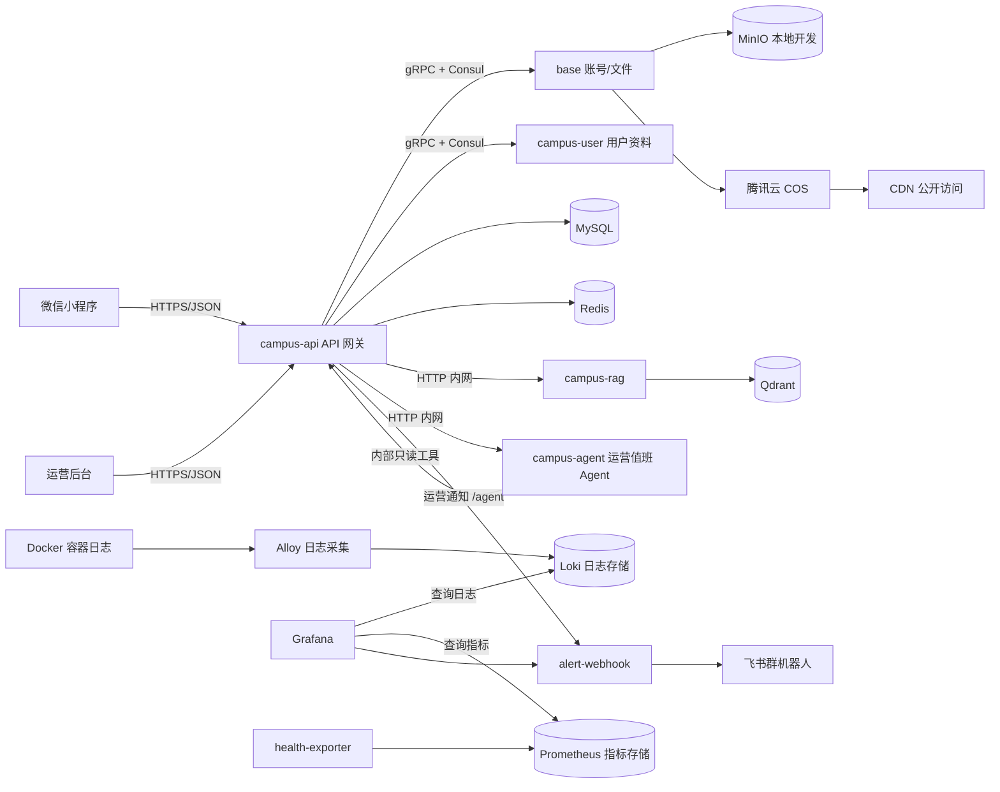

# lehu-campus 校园 e站

校园 e站后端以小程序社区、课表、运营后台、e仔 AI/RAG、运营值班 Agent 和浏览器内排障为主。项目保留轻量微服务架构：Go Kratos 服务通过 gRPC + Consul 做内部通信，Python RAG/Agent 服务通过 Docker 内网 HTTP 接入，所有服务以 Docker 容器部署。

## 架构与设计

校园 e站第一阶段按“小团队可运维、低成本首发、浏览器内排障、轻量微服务拆分”设计。当前项目只服务校园社区，不再包含旧短视频、IM chat、Kafka、WebSocket 运行栈。



核心服务职责：

- `api`：统一 HTTP 入口和 API 网关，承载小程序接口、运营后台接口、审核、通知、e仔任务编排和健康检查。
- `base`：账号、验证码、文件预签名上传、对象存储确认。本地用 MinIO，生产公开媒体用 COS + CDN。
- `campus-user`：用户资料、搜索、统计和在线时间。
- `campus-rag`：知识库文档解析、切片、embedding 和 Qdrant 检索。
- `campus-agent`：LangGraph 运营值班 Agent，负责每日巡检、RAG 缺口分析、治理建议和发帖 AI/Agent 初审判断。
- `admin-web`：运营后台，随主项目一起构建和部署。
- `grafana / loki / alloy / prometheus / health-exporter / alert-webhook`：日志搜索、健康监控和飞书告警。

微服务通信关系：

- 小程序和运营后台只访问 `campus-api` 的 HTTP API。
- `campus-api` 通过 gRPC + Consul 调用 `base` 和 `campus-user`。
- `campus-api` 通过 Docker 内网 HTTP 调用 `campus-rag`。
- `campus-api` 通过 Docker 内网 HTTP 调用 `campus-agent`，Agent 再用内部 token 读取 `campus-api` 只读工具接口。
- `base`、`campus-user`、`campus-api` 是独立 Go Kratos 容器；`campus-rag` 是独立 Python 容器。

关键链路：

- 发帖链路：小程序/后台调用 API；文字/图片帖写 MySQL；图片先走 `/v1/campus/upload/presign` 直传对象存储，再 `/complete` 确认；后端固定拒绝视频。
- 媒体链路：生产公开图片不走服务器出网，`base` 返回 COS 上传地址和 CDN 访问地址，避免轻量服务器带宽被图片占满。
- e仔链路：评论区 `@e仔` 先落任务；需要校园事实时查 RAG；命中资料后再生成官方账号回复；未配置模型时降级，不影响社区主链路。
- 运营提醒链路：举报、重要反馈、待人工确认审核和每日巡检会通过 `alert-webhook` 推飞书；其中举报/反馈先进入 `campus_ops_alert` 队列，不调用 Agent 模型。发帖审核规则先做风险分级，普通帖子异步调用 `campus-agent`，高置信低风险自动通过，中高风险或不确定内容做人机确认。
- 排障链路：用户拿到 `request_id` 后，在 Grafana 日志搜索定位入口日志；健康面板用于判断 API、Redis、RAG、Agent 等组件是否可用，生产云 MySQL 由 `api_ready` 间接覆盖。

图里的监控链路可以这样理解：

- `MinIO`：本地开发默认对象存储。生产公开图片走腾讯云 COS + CDN，生产 compose 默认不启动本地 MinIO。
- `Alloy`：采集 Docker 容器日志，送到 `Loki`。
- `Loki`：存日志。Grafana 通过 Loki 查 `request_id`、接口路径、错误日志。
- `health-exporter`：主动探测 API、Redis、RAG、Agent、飞书桥接、Qdrant 等目标是否可用，并把结果变成指标；生产云 MySQL 不单独 TCP 探测，先看 `api_ready`。
- `alert-webhook`：接收 Grafana 告警和运营通知，发到飞书群；运营通知包含 Agent 报告、举报/反馈、审核提醒和 SLA 提醒，生产不要暴露公网。
- `Prometheus`：定时抓取并保存这些健康指标，例如某个目标当前是 up 还是 down、连续 down 了多久。
- `Grafana`：同时查询 Loki 和 Prometheus；Loki 用来看“为什么报错”，Prometheus 用来看“哪里挂了”和触发告警。

设计取舍：

- 首发只支持文字/图片校园社区，视频能力不对外开放，降低带宽、审核和恶意刷流量风险。
- 公开媒体用 COS + CDN，数据库和 Go 服务仍跑在轻量服务器，控制首发成本。
- Redis 保留给登录态辅助、限流、缓存和短期任务状态；用户计数不再做复杂 dirty set 同步，优先让系统简单可控。
- 运营值班 Agent 只做巡检、RAG 缺口、治理建议和发帖中高风险初审；举报/反馈/SLA 是运营提醒队列，不包装成 Agent 推理。
- 监控采用 Grafana + Loki + Prometheus + Alloy，尽量在浏览器内完成查日志、看健康和收告警。
- 运行中数据库不自动 drop 历史表；新库初始化以 `sql/campus.sql` 为准。

第一次接手项目建议先读 [docs/README.md](docs/README.md) 和 [docs/product-feature-design.md](docs/product-feature-design.md)，先理解功能边界，再读 [docs/developer-guide.md](docs/developer-guide.md)。更细的服务拓扑见 [docs/architecture.md](docs/architecture.md)，上线清单见 [docs/launch-readiness-checklist.md](docs/launch-readiness-checklist.md)，发布策略见 [docs/release-strategy.md](docs/release-strategy.md)，微服务边界与简历表达见 [docs/microservices.md](docs/microservices.md) 和 [docs/resume-highlights.md](docs/resume-highlights.md)。

## 本地 Docker 启动

```bash
cd /Users/firetang/Documents/lehu/lehu-campus
docker compose up -d --build
```

如果本机之前用旧 Compose 项目名启动过，第一次切换到 `lehu-campus` 前先停旧 stack，避免端口或容器名冲突：

```bash
docker compose -p lehu-video-backend down
docker compose -p campus-estation-backend down
```

默认启动的校园 e站服务：

```text
mysql / redis / consul / minio / qdrant / campus-rag
base / campus-user / api / campus-agent / admin-web
health-exporter / alert-webhook / prometheus / loki / alloy / grafana
```

默认关键环境变量：

```bash
export LEHU_STORAGE_PROVIDER=minio
export LEHU_ENABLE_LEGACY_UPLOAD=false
```

推荐复制本地环境变量模板，真实本地配置不进仓库：

```bash
cp .env.local.example .env.local
docker compose --env-file .env.local up -d --build
```

也可以直接 `docker compose up -d --build`，因为 `docker-compose.yml` 保留了本地默认值；但长期建议本地和生产都使用 `example -> real env` 的同一套习惯。

## 生产 Docker 启动

生产使用 `docker-compose.prod.yml` 作为覆盖文件，本地开发方式不变。先复制示例环境变量并替换所有占位值：

```bash
cp .env.production.example .env.production
```

启动：

```bash
docker compose --env-file .env.production -f docker-compose.yml -f docker-compose.prod.yml up -d --build
```

生产覆盖文件默认不启动本地 MySQL、MinIO 和 `minio-init`，业务使用云 MySQL 与 COS/CDN；Redis、Consul、Qdrant、Prometheus、base、campus-user 不暴露到宿主机。API、运营后台、Grafana 只绑定 `127.0.0.1`，建议由 Caddy/Nginx 反向代理统一暴露 HTTPS。

API 反向代理需要显式拒绝 `/v1/campus/internal/*`，这些路径只给 Docker 内网里的 Agent 工具和 Prometheus 指标使用；公网验收时应确认 `/v1/campus/internal/ops-metrics` 返回 404/403。

如果临时要在生产 compose 里启用本地 MySQL/MinIO，需要显式加 `COMPOSE_PROFILES=local-stateful`，并自行把 DSN/storage provider 切回本地。

本地地址：

```text
API：http://localhost:18080
运营后台：http://localhost:15173/admin
Grafana：http://localhost:13002
Prometheus：http://localhost:19090
MinIO API：http://localhost:19000
MinIO 控制台：http://localhost:19001
```

## 生产必配

正式/体验服务器至少配置一个管理员：

```bash
export LEHU_CAMPUS_ADMIN_USER_IDS=你的用户ID
```

正式环境不要开启：

```bash
export LEHU_CAMPUS_ADMIN_ALLOW_ALL=true
export LEHU_WECHAT_MOCK_LOGIN=true
```

小程序正式登录需要：

```bash
export WECHAT_APP_ID=你的小程序AppID
export WECHAT_APP_SECRET=你的小程序AppSecret
export LEHU_WECHAT_MOCK_LOGIN=false
```

## 数据库与文件

默认初始化脚本：

```text
sql/campus.sql
```

全新生产云 MySQL 只执行 `sql/campus.sql`。首发前历史增量已经折叠进该文件并清理；上线以后若有真实数据，再新增时间戳增量 SQL 给已有库升级。SQL 目录说明见 [sql/README.md](sql/README.md)。

默认数据库名：

```text
lehu_campus_db
```

默认 MinIO bucket / 文件域：

```text
campus
```

生产公开媒体不走服务器本机 MinIO。帖子图片、头像、反馈图片、运营发帖图片使用腾讯云 COS + CDN：

```bash
export LEHU_STORAGE_PROVIDER=cos
export COS_SECRET_ID=腾讯云SecretId
export COS_SECRET_KEY=腾讯云SecretKey
export COS_REGION=ap-guangzhou
export COS_BUCKET=campus-1250000000
export COS_PUBLIC_CDN_BASE_URL=https://cdn.example.com
```

`/v1/campus/upload/presign` 仍返回预签名 PUT 地址，前端直传后调用 `/v1/campus/upload/complete`。生产环境下公开访问 URL 会返回 CDN 域名，不再占用轻量服务器出网带宽。

生产默认关闭 `/v1/campus/upload/image` 图片中转上传，避免 COS/CDN 故障时退回轻量服务器出网。只有本地调试需要兼容旧客户端时，才临时设置：

```bash
export LEHU_ENABLE_LEGACY_UPLOAD=true
```

微信公众平台需要配置：

```text
request 合法域名：API 域名、COS 上传域名，例如 https://campus-1250000000.cos.ap-guangzhou.myqcloud.com
downloadFile 合法域名：CDN 下载域名，例如 https://cdn.example.com
```

腾讯云控制台需要配置 COS CORS、CDN 回源、图片缓存规则和基础防盗刷策略。MinIO 只作为本地开发和低频内部文件过渡；知识库/RAG 文件暂不在这一阶段做公开 CDN 化，后续可单独迁到私有 COS。

帖子只支持文字和图片，后端固定拒绝视频上传和视频帖。

## e仔与 RAG

完整设计见 [docs/ai-rag.md](docs/ai-rag.md)，里面写了 e仔人设、自动回复、本地知识库、RAG 检索、后台测试和降级策略。

Go 后端负责任务、权限、e仔回复编排；`campus-rag` 只在 Docker 内网提供解析、切片、embedding、Qdrant 检索。

```text
CAMPUS_RAG_BASE_URL=http://campus-rag:8090
CAMPUS_RAG_EMBEDDING_MODEL=BAAI/bge-m3
SILICONFLOW_API_KEY=sk-xxx
```

e仔 AI 回复和值班 Agent 默认使用 DeepSeek/OpenAI 兼容接口：

```text
DEEPSEEK_API_KEY=sk-xxx
CAMPUS_EZAI_BOT_USER_ID=123
CAMPUS_AI_DAILY_LIMIT=200
CAMPUS_AI_MODEL=deepseek-v4-flash
CAMPUS_AI_BASE_URL=https://api.deepseek.com/chat/completions
CAMPUS_AI_BUDGET_ENABLED=true
CAMPUS_AI_MONTHLY_BUDGET_CNY=20
CAMPUS_AI_DAILY_BUDGET_CNY=2
```

未配置 API Key 时，e仔/RAG 会降级，不影响社区主链路。

## 运营值班 Agent

完整设计见 [docs/agent-copilot.md](docs/agent-copilot.md)。`campus-agent` 是独立 Python FastAPI 服务，使用 LangGraph 编排受控工具调用，不面向学生端，不直接连 MySQL/Redis，也不直接执行删帖、封号、审核通过等写操作。

真正属于 Agent 的能力：

- `daily_ops`：每日运营巡检，汇总社区、审核、e仔、RAG 和安全状态。
- `rag_gap`：知识库缺口分析，从错误标注、低置信日志和失败任务里找待补资料。
- `moderation_advice`：治理建议，结合待审、举报、反馈和失败任务给优先级。
- 发帖 AI/Agent 初审：本地规则先做风险分级，普通帖子异步调用 `campus-agent` 复核；高置信低风险自动通过，中高风险或不确定内容进入飞书/后台人工确认。

不属于 Agent 推理、但属于运营值班体系的能力：

- 举报、重要反馈、SLA 超时和飞书发送失败进入 `campus_ops_alert` 队列。
- 队列负责可靠提醒、去重、退避重试和飞书处理回执，不调用 Agent 模型。
- 飞书按钮的通过、拒绝、下架、忽略都回到 `campus-api` 校验一次性 token 后执行。

关键配置：

```text
CAMPUS_AGENT_SERVICE_URL=http://campus-agent:8091
CAMPUS_AGENT_INTERNAL_TOKEN=随机长token
CAMPUS_AGENT_ENABLED=true
CAMPUS_AGENT_AUDIT_ENABLED=true
CAMPUS_AGENT_MAX_CONCURRENT_RUNS=1
CAMPUS_AGENT_DAILY_REPORT_ENABLED=true
CAMPUS_AGENT_DAILY_REPORT_TIME=09:30
CAMPUS_OPS_FEISHU_EVENTS_ENABLED=true
CAMPUS_AI_BUDGET_ENABLED=true
CAMPUS_AI_MONTHLY_BUDGET_CNY=20
CAMPUS_AI_DAILY_BUDGET_CNY=2
```

后台 `/admin/audit` 可以直接开关 Agent 模型能力、AI 初审、飞书运营通知和 AI 预算，不需要重启容器。后台 `/admin/copilot` 可以手动运行三种 Agent 报告、查看最近运行、发送飞书，并查看飞书提醒队列是否积压。

默认运营提醒：

- 用户举报帖子/评论：即时飞书。
- `contact/cooperation/bug/content` 反馈：即时飞书。
- 普通 `suggestion`：默认只进后台和日报，避免噪音。
- 待人工确认审核、AI 预算 70%/90%、SLA 超时：飞书提醒。

## 监控与日志

完整说明见 [docs/observability-alerting.md](docs/observability-alerting.md)，里面写了 Grafana、Loki、Alloy、Prometheus、health-exporter 和飞书告警的职责、查询方式、告警规则和处理流程。

API 限流会使用真实客户端 IP。后端只在请求来自可信代理网段时读取 `X-Forwarded-For` / `X-Real-IP`，默认可信代理包含 loopback、Docker/内网网段。生产有独立反代或负载均衡时可显式配置：

```bash
export LEHU_TRUSTED_PROXY_CIDRS=127.0.0.0/8,10.0.0.0/8,172.16.0.0/12,192.168.0.0/16
```

Docker 本地日志已限制为每个容器 `20m * 3`，避免本地 json log 无限增长；Grafana/Loki 仍按 Loki 留存配置查询近期日志。普通容器日志不写 MySQL。

MySQL 内的 `campus_access_log` 会由 API 后台任务按保留期自动清理，默认保留 7 天。生产可按磁盘预算调整：

```bash
export LEHU_ACCESS_LOG_RETENTION_DAYS=7
```

健康检查：

```text
GET http://localhost:18080/healthz
GET http://localhost:18080/readyz
```

Grafana：

```text
http://localhost:13002
账号：admin
密码：admin
```

预置面板：

```text
Dashboards -> Campus e站 -> 校园 e站日志搜索
Dashboards -> Campus e站 -> 校园 e站健康监控
```

常用 LogQL：

```logql
{job="docker"} |= "用户提供的请求编号"
{job="docker", container="campus-api"} |= "/v1/campus/forum/posts"
{job="docker"} |~ "status(=|\":) ?500"
{job="docker"} |= "trace_id"
```

命令行兜底：

```bash
make logs-request RID=用户提供的请求编号 SINCE=30m
make logs-trace TID=trace_id SINCE=30m
make logs-search Q="/v1/campus/forum/posts" SINCE=2h
```

### 飞书告警

第一版告警链路是 `Grafana Alerting -> alert-webhook -> 飞书群机器人`。`alert-webhook` 只暴露在 Docker 内网，不映射宿主机端口；本地没有配置飞书 webhook 时只打印日志，不影响 Grafana 启动。

生产环境在 `.env.production` 配置：

```bash
LEHU_ALERT_ENV=prod
LEHU_ALERT_WEBHOOK_TOKEN=一段随机长token
LEHU_ALERT_FEISHU_WEBHOOK=https://open.feishu.cn/open-apis/bot/v2/hook/xxx
LEHU_ALERT_FEISHU_SECRET=飞书机器人签名密钥
GRAFANA_ROOT_URL=https://grafana.example.com
```

飞书群里创建“自定义机器人”，复制 webhook；建议开启“签名校验”，把签名密钥填到 `LEHU_ALERT_FEISHU_SECRET`。当前只报 P0/P1：API/ready、Redis、health-exporter 连续 2 分钟不可用发 critical；base、campus-user、RAG、campus-agent、alert-webhook、Qdrant、Consul 连续 3 分钟不可用发 warning。生产云 MySQL 和 COS/CDN 不在本机 health-exporter 里单独探测，先通过 `api_ready` 和云厂商监控覆盖。

本地模拟一条 Grafana webhook：

```bash
docker compose up -d alert-webhook
docker compose exec -T alert-webhook python - <<'PY'
import json
import urllib.request

payload = {
    "status": "firing",
    "commonLabels": {"alertname": "CampusCriticalTargetDown", "severity": "critical"},
    "alerts": [{
        "labels": {"name": "api_ready", "target": "http://api:8080/readyz"},
        "annotations": {"summary": "校园 e站核心目标不可用：api_ready"},
        "startsAt": "2026-05-29T00:00:00Z"
    }]
}
req = urllib.request.Request(
    "http://127.0.0.1:9120/grafana?token=local-alert-token",
    data=json.dumps(payload).encode(),
    headers={"Content-Type": "application/json"},
    method="POST",
)
print(urllib.request.urlopen(req, timeout=5).read().decode())
PY
```

收到飞书告警后的处理顺序：先看飞书里的目标名，再进 Grafana 健康面板确认哪块不可用，最后按服务名、接口路径或 request_id 到日志搜索定位原因。

## 冒烟测试

```bash
API_BASE=http://127.0.0.1:18080/v1 ./scripts/smoke.sh
```

该脚本会注册测试用户、登录、读取校园版块并发布一条文字 smoke 帖。

## 发布检查

没有独立测试环境时，发布前先跑：

```bash
bash scripts/release-check.sh
```

这条检查会跑 Go、运营后台构建、Python RAG/Agent 单测和 compose config；真实 `.env.production` 还会拦截占位符、mock 登录、admin allow all、旧图片中转上传等危险配置。

服务器上要连同当前运行服务一起检查：

```bash
RUN_HEALTH_CHECK=1 RUN_GO_TESTS=0 RUN_ADMIN_BUILD=0 RUN_PYTHON_TESTS=0 bash scripts/release-check.sh
```

更完整的无感更新和轻量蓝绿发布方案见 [docs/release-strategy.md](docs/release-strategy.md)。

当前 GitHub Actions 已配置为：PR 到 `campus-estation-cleanup` 只跑检查，push 到 `campus-estation-cleanup` 会在检查通过后 SSH 到服务器执行生产部署。需要在 GitHub Secrets 里配置 `DEPLOY_HOST / DEPLOY_PORT / DEPLOY_USER / DEPLOY_SSH_KEY / DEPLOY_PATH`。

## 成本建议

首发 300 人试运营、关闭视频帖、公开媒体走 COS + CDN、图片压缩的前提下，建议：

```text
2核4G 轻量服务器 + 1核1G 云 MySQL + 本机 Redis
```

业务数据统一放同一个云 MySQL，不做双 MySQL 拆库；生产 compose 默认不启动本地 MySQL/MinIO；Redis 用于真实 IP 限流和热点读缓存；普通容器日志走 Loki，`campus_access_log` 默认只保留 7 天。不要降到 2G 内存。后续如果图片量、同时在线、慢查询或 MySQL CPU 明显升高，再升级服务器或云 MySQL。
