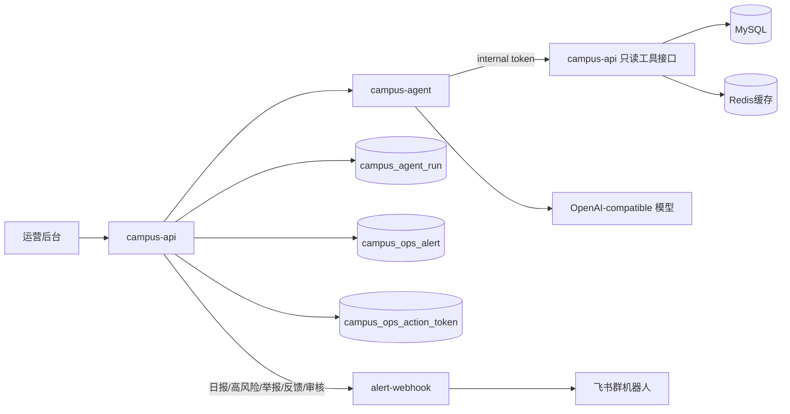
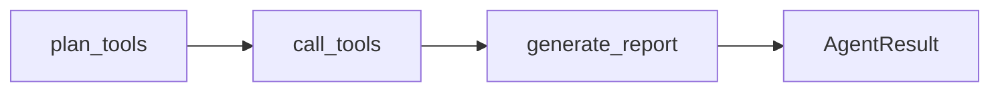
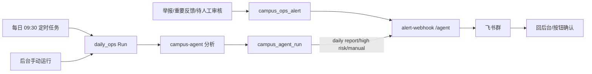

# 运营值班 Agent 设计

运营值班 Agent 是校园 e站的后台运营自动化服务。它不面向学生，主要目标是减少人工盯后台：定时巡检、举报/重要反馈主动飞书提醒、AI/Agent 发帖初审，以及不确定内容的飞书人工确认闭环。

边界很明确：`campus-agent` 只产出判断、理由和风险等级；真正写库的通过/拒绝、通知作者、审核日志都由 `campus-api` 执行。除低风险高置信帖子可自动通过外，高风险治理动作不自动执行。

## 架构



服务边界：

- `campus-agent` 是独立 Python 服务，使用 LangGraph 编排 Agent 工作流。
- `campus-api` 仍是唯一公网 HTTP 入口，负责后台鉴权、运行记录入库和内部工具接口。
- `campus-agent` 不直连 MySQL、Redis、Loki、Prometheus；巡检类任务只通过 `campus-api` 的只读工具取数。
- AI/Agent 发帖审核走 `campus-api -> campus-agent /internal/moderation/audit`，Agent 返回 `decision/confidence/risk_level/reason/evidence`。
- 飞书通知复用 `alert-webhook`，和 Grafana 告警共用同一个飞书机器人配置，但入口不同：Grafana 用 `/grafana`，Agent 运营通知用 `/agent`。

## LangGraph 工作流

第一版图很克制：



- `plan_tools`：根据任务类型选择 allowlist 工具，最多 6 个。
- `call_tools`：通过 LangChain tool 调用 `campus-api` 内部只读接口。
- `generate_report`：优先调用模型生成结构化 JSON；模型不可用或 JSON 不合法时，返回规则 fallback 报告。

这不是开放式“任意行动”的 Agent，而是受控运营 Agent。好处是可解释、可排障、权限边界清楚。Agent 报告会同时使用工具调用 trace 和结构化运营摘要，摘要只保留前几条关键对象，例如待审帖子、举报、重要反馈、e仔失败任务和 RAG 异常问题，避免模型只能输出泛泛建议。

## 任务类型

| 类型 | 作用 |
| --- | --- |
| `daily_ops` | 每日运营巡检，汇总社区、审核、e仔、RAG、安全状态 |
| `rag_gap` | 知识库缺口分析，找出错误标注、低置信度和评测失败问题 |
| `moderation_advice` | 内容治理建议，按待审核、举报、反馈、失败任务给优先级 |

输出统一为：

- `summary`
- `risk_level`
- `findings`
- `recommendations`
- `evidence`
- `next_actions`

后台会把 `next_actions` 渲染为跳转按钮，例如去审核、去 e仔回复状态、去 RAG 评测、去安全中心。

## 安全边界

- 对外接口 `/v1/campus/admin/copilot/runs` 需要后台管理员或运营权限。
- 对外接口 `/v1/campus/admin/copilot/runs/{id}/send-feishu` 只允许后台管理员或运营手动发送已完成结果。
- 内部工具接口只接受 `X-Campus-Agent-Token`。
- 巡检、RAG 缺口、治理建议的工具全部只读。
- 发帖审核的写操作只由 `campus-api` 执行，`campus-agent` 不直接写库。
- Agent/飞书值班开关存在 `campus_ops_setting`，环境变量只作为默认值；运营后台保存后以数据库配置为准，不需要重启容器。
- 飞书按钮使用 `campus_ops_action_token` 一次性 token，默认 24 小时过期，token 绑定目标和动作。
- 发帖审核支持飞书内“通过/拒绝”；帖子/评论举报支持飞书内“下架内容/忽略举报”；反馈仍只提醒并跳后台处理。
- 高风险或低置信审核不自动拒绝，只保留待审核并提醒人工确认。

## AI/Agent 发帖审核

后台“审核设置”里的 `AI/Agent 初审` 开启后，新帖先走 `campus-api` 本地规则。明显低风险直接自动同步，不调用模型、不发飞书；中风险/不确定/高风险才进入 `campus_ai_audit_task`，由后台任务在预算允许时调用 `campus-agent`。

审核关键词在 `/admin/audit` 的“审核关键词”面板配置，存入 `campus_ops_setting`。`audit_high_risk_words` 命中后保留待审并推高优先级提醒，不允许 Agent 自动洗白；`audit_review_words` 命中后进入 Agent/人工复核。`campus-api` 本地规则和 `campus-agent /internal/moderation/audit` 使用同一份词表，配置为空或读取失败时回退默认词表。

策略：

| 判断结果 | 系统行为 |
| --- | --- |
| 本地规则 `low` | 自动设为可见，不调模型、不打扰作者 |
| 本地规则 `medium/uncertain` 且 Agent `pass + low + confidence >= 0.9` | 自动设为可见 |
| Agent `review/reject/medium/high` 或 `confidence < 0.9` | 保持待审核，生成飞书审批卡片 |
| 本地规则 `high` | 即使 Agent 复核为低风险，也保持待审核并推飞书 |
| 预算超限或 Agent 不可用 | 低风险照常通过，其他内容保留待审核并飞书提醒 |

飞书审核卡片包含帖子摘要、风险等级、Agent 理由、后台链接，以及“通过/拒绝”按钮。举报卡片包含举报原因、目标类型和“下架内容/忽略举报/打开后台”按钮。按钮背后都是一次性 token 调用 `campus-api /v1/campus/feishu/card/callback`；如果公网回调或飞书能力不完整，仍可降级为打开后台处理。

小程序端采用“作者可见优先”：待审核帖子不进入公共首页，但作者本人可在详情和“我的帖子”看到；客户端优先展示 `publish_state/client_status_label/client_status_detail`，不要直接展示后台审核原因。

## 飞书运营闭环

第一版运营闭环是：



触发方式：

| 场景 | 行为 |
| --- | --- |
| 每日巡检 | `campus-api` 后台任务默认每天 `09:30 Asia/Shanghai` 创建一次 `daily_ops`，完成后发送飞书日报 |
| 高风险提醒 | 手动运行完成后如果 `risk_level=high`，自动发送一条高风险提醒 |
| 手动发送 | 运营在 `/admin/copilot` 对任意 `done` 状态运行记录点击“发送到飞书” |
| 举报提醒 | 用户举报帖子/评论后写入 `campus_ops_alert`，后台任务 5 秒级扫描并推飞书，可在飞书内下架或忽略；举报人会收到站内确认和处理结果 |
| 重要反馈 | `contact/cooperation/bug/content` 类型即时提醒，普通 `suggestion` 进入日报 |
| 审核确认 | Agent 拿不准的帖子推飞书卡片，可点通过/拒绝或回后台 |

发送失败不会改写 Agent 的分析结果，只会更新运行记录里的飞书状态。后台列表会展示 `pending/sent/failed/skipped`。`/admin/copilot` 还会展示“飞书提醒队列”：待发送、发送中、失败、今日已发送、最近错误和最近提醒，用来确认飞书值班链路是否真的在工作；失败重试仍由后台任务退避处理，不在页面手动重发。

`campus_agent_run` 记录这些字段：

| 字段 | 含义 |
| --- | --- |
| `source` | `manual` 或 `scheduled` |
| `feishu_status` | `pending/sent/failed/skipped` |
| `feishu_sent_at` | 成功发送时间 |
| `feishu_error` | 短错误原因，不保存完整飞书响应正文 |

## 配置

```bash
# campus-api 调用 campus-agent 的内网服务地址。
CAMPUS_AGENT_SERVICE_URL=http://campus-agent:8091
CAMPUS_AGENT_INTERNAL_TOKEN=change-me-long-random-agent-token

# campus-agent 调用 campus-api 内部只读工具接口。
CAMPUS_API_INTERNAL_BASE_URL=http://api:8080/v1

# 可选：独立 Agent 模型配置。这里的 BASE_URL 是 OpenAI-compatible 模型接口地址，
# 不要填成 campus-agent 服务地址。
CAMPUS_AGENT_API_KEY=
CAMPUS_AGENT_BASE_URL=
CAMPUS_AGENT_MODEL=deepseek-v4-flash

# 未配置独立模型时回退这组
CAMPUS_AI_API_KEY=
CAMPUS_AI_BASE_URL=https://api.deepseek.com/chat/completions
CAMPUS_AI_MODEL=deepseek-v4-flash

# AI 成本账本与预算保护
CAMPUS_AI_BUDGET_ENABLED=true
CAMPUS_AI_MONTHLY_BUDGET_CNY=20
CAMPUS_AI_DAILY_BUDGET_CNY=2
CAMPUS_AI_BUDGET_WARN_RATIO=0.7,0.9
CAMPUS_AI_PRICE_INPUT_USD_PER_M=0.14
CAMPUS_AI_PRICE_OUTPUT_USD_PER_M=0.28
CAMPUS_AI_USD_CNY_RATE=7.2

# 值班 Agent 飞书通知
CAMPUS_AGENT_ENABLED=true
CAMPUS_AGENT_FEISHU_ENABLED=true
CAMPUS_AGENT_DAILY_REPORT_ENABLED=true
CAMPUS_AGENT_DAILY_REPORT_TIME=09:30
CAMPUS_AGENT_HIGH_RISK_NOTIFY_ENABLED=true
CAMPUS_OPS_FEISHU_EVENTS_ENABLED=true
CAMPUS_OPS_FEISHU_REPORT_NOTIFY=true
CAMPUS_OPS_FEISHU_FEEDBACK_NOTIFY=true
CAMPUS_OPS_FEISHU_FEEDBACK_NOTIFY_TYPES=contact,cooperation,bug,content
CAMPUS_AGENT_AUDIT_ENABLED=true
CAMPUS_AGENT_AUDIT_AUTO_PASS_CONFIDENCE=0.9
CAMPUS_AI_AUDIT_BATCH_SIZE=2
CAMPUS_AI_AUDIT_TASK_TIMEOUT=10s
CAMPUS_AGENT_RUN_STALE_AFTER=10m
CAMPUS_AGENT_MAX_CONCURRENT_RUNS=1
LEHU_ALERT_WEBHOOK_INTERNAL_URL=http://alert-webhook:9120
LEHU_ALERT_WEBHOOK_TOKEN=change-me-long-random-alert-token
LEHU_PUBLIC_API_BASE_URL=https://api.example.com/v1
LEHU_ADMIN_ROOT_URL=https://admin.example.com
LEHU_FEISHU_CARD_CALLBACK_ENABLED=true
LEHU_FEISHU_CARD_VERIFY_TOKEN=
```

`campus_ai_usage_log` 会记录 Agent 巡检、发帖审核、e仔回复和后台 e仔预览的模型调用 token 与预估成本。超过月预算 70%/90% 会推飞书预警；超过日/月硬预算后，非低风险发帖会进入人工待审，e仔和 Copilot 会走降级结果。

每日后台任务还会从真实 `campus_rag_query_log` 里把 `wrong/needs_fix/unsafe`、低置信需要知识的问题和失败问题沉淀为停用状态的 `campus_rag_eval_case` 草稿。运营可在知识库评测页筛选“Agent 草稿”并批量启用。

本地如果没有模型 key，Agent 仍会生成规则 fallback 报告，方便开发演示。

本地如果没有配置 `LEHU_ALERT_FEISHU_WEBHOOK`，`alert-webhook` 会返回 `missing_webhook`，Agent 运行会标记为 `skipped`，不会影响后台使用。

上线后建议在运营后台 `/admin/audit` 里确认这些开关：

- `Agent 模型能力`：关闭后手动 Copilot、日报和 AI 初审都不再调用模型。
- `AI/Agent 初审`：关闭后即使审核模式选 `ai`，新帖也会退化为人工待审。
- `飞书运营通知`：关闭后举报、反馈、审核待确认、日报和高风险提醒都不再发飞书。
- `举报提醒`、`重要反馈提醒`、`每日报告`、`高风险提醒`：用于控制具体通知噪音。

## 排障

| 现象 | 优先看 |
| --- | --- |
| 后台运行 Agent 失败 | `campus-api` 日志、`campus-agent` 健康状态、`CAMPUS_AGENT_INTERNAL_TOKEN` |
| 工具调用失败 | 运行详情里的 `tool_trace`，以及 `campus-api` 内部工具接口日志 |
| 飞书未收到日报 | `CAMPUS_AGENT_DAILY_REPORT_ENABLED`、`CAMPUS_AGENT_DAILY_REPORT_TIME`、`alert-webhook` 日志 |
| 举报/反馈没提醒 | `/admin/audit` 的值班 Agent 开关、`campus_ops_alert` 状态、`alert-webhook` 日志 |
| 举报人没收到结果 | `campus_notification_outbox`、通知任务日志、举报状态是否已处理 |
| 飞书按钮不能处理审核 | `LEHU_PUBLIC_API_BASE_URL` 是否公网 HTTPS、`campus_ops_action_token` 是否过期 |
| 飞书显示未配置 | `api` 和 `alert-webhook` 容器里的 `LEHU_ALERT_FEISHU_WEBHOOK` 是否都已配置 |
| 飞书链接打不开 | `LEHU_ADMIN_ROOT_URL` 是否是可访问的运营后台 HTTPS 地址 |

## 面试表达

可以这样讲：

> 我在校园 e站里做了一个运营值班 Agent，独立为 `campus-agent` 微服务，使用 LangGraph 编排巡检类工具调用，用 LangChain tool 封装只读后台工具接口；同时把发帖 AI 审核迁到 Agent 服务。系统支持每日巡检、RAG 缺口分析、举报/重要反馈飞书主动提醒，以及发帖审核和举报治理的 human-in-the-loop 闭环：低风险高置信自动通过，不确定或高风险内容推飞书卡片，由运营点击通过/拒绝/下架/忽略，真正写库仍由 `campus-api` 完成。
