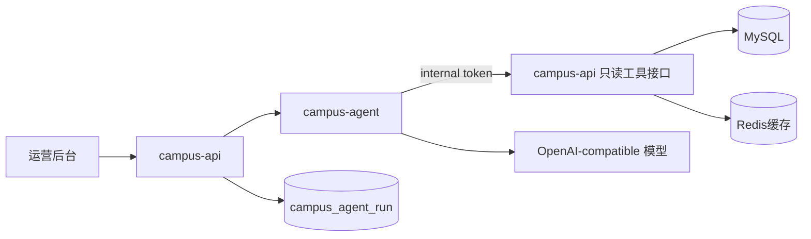
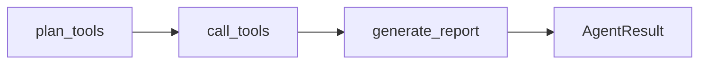

# 运营 Copilot Agent 设计

运营 Copilot 是校园 e站的后台只读 Agent。它不面向学生，也不自动执行删帖、封禁、审核通过、改配置等高风险动作。第一版目标是把后台数据、RAG 质量、审核队列和安全状态串起来，给运营同学生成可解释的处理建议。

## 架构



服务边界：

- `campus-agent` 是独立 Python 服务，使用 LangGraph 编排 Agent 工作流。
- `campus-api` 仍是唯一公网 HTTP 入口，负责后台鉴权、运行记录入库和内部工具接口。
- `campus-agent` 不直连 MySQL、Redis、Loki、Prometheus，第一版只通过 `campus-api` 的只读工具取数。

## LangGraph 工作流

第一版图很克制：



- `plan_tools`：根据任务类型选择 allowlist 工具，最多 6 个。
- `call_tools`：通过 LangChain tool 调用 `campus-api` 内部只读接口。
- `generate_report`：优先调用模型生成结构化 JSON；模型不可用或 JSON 不合法时，返回规则 fallback 报告。

这不是开放式“任意行动”的 Agent，而是受控运营 Agent。好处是可解释、可排障、权限边界清楚。

## 任务类型

| 类型 | 作用 |
| --- | --- |
| `daily_ops` | 每日运营巡检，汇总社区、审核、e仔、RAG、安全状态 |
| `rag_gap` | 知识库缺口分析，找出错误标注、低置信度和评测失败问题 |
| `moderation_advice` | 内容治理建议，按待审核、举报、反馈、失败任务给优先级 |

输出统一为：

- `summary`
- `risk_level`
- `findings`
- `recommendations`
- `evidence`
- `next_actions`

后台会把 `next_actions` 渲染为跳转按钮，例如去审核、去 e仔回复状态、去 RAG 评测、去安全中心。

## 安全边界

- 对外接口 `/v1/campus/admin/copilot/runs` 需要后台管理员或运营权限。
- 内部工具接口只接受 `X-Campus-Agent-Token`。
- Agent 工具全部只读。
- Agent 结果只作为建议，页面明确显示“只读分析，运营确认后再处理”。
- 写操作仍然走原后台页面，由人点击确认。

## 配置

```bash
# campus-api 调用 campus-agent 的内网服务地址。
CAMPUS_AGENT_SERVICE_URL=http://campus-agent:8091
CAMPUS_AGENT_INTERNAL_TOKEN=change-me-long-random-agent-token

# campus-agent 调用 campus-api 内部只读工具接口。
CAMPUS_API_INTERNAL_BASE_URL=http://api:8080/v1

# 可选：独立 Agent 模型配置。这里的 BASE_URL 是 OpenAI-compatible 模型接口地址，
# 不要填成 campus-agent 服务地址。
CAMPUS_AGENT_API_KEY=
CAMPUS_AGENT_BASE_URL=
CAMPUS_AGENT_MODEL=

# 未配置独立模型时回退这组
CAMPUS_AI_API_KEY=
CAMPUS_AI_BASE_URL=https://api.deepseek.com/chat/completions
CAMPUS_AI_MODEL=deepseek-chat
```

本地如果没有模型 key，Agent 仍会生成规则 fallback 报告，方便开发演示。

## 面试表达

可以这样讲：

> 我在校园 e站里新增了运营 Copilot Agent，独立为 `campus-agent` 微服务，使用 LangGraph 编排 `plan_tools -> call_tools -> generate_report` 工作流，用 LangChain tool 封装只读后台工具接口。Agent 能读取运营统计、审核队列、RAG 查询日志、评测集和安全面板，生成每日巡检、知识库缺口和内容治理建议；所有高风险写操作都采用 human-in-the-loop，Agent 只给建议不自动执行。
