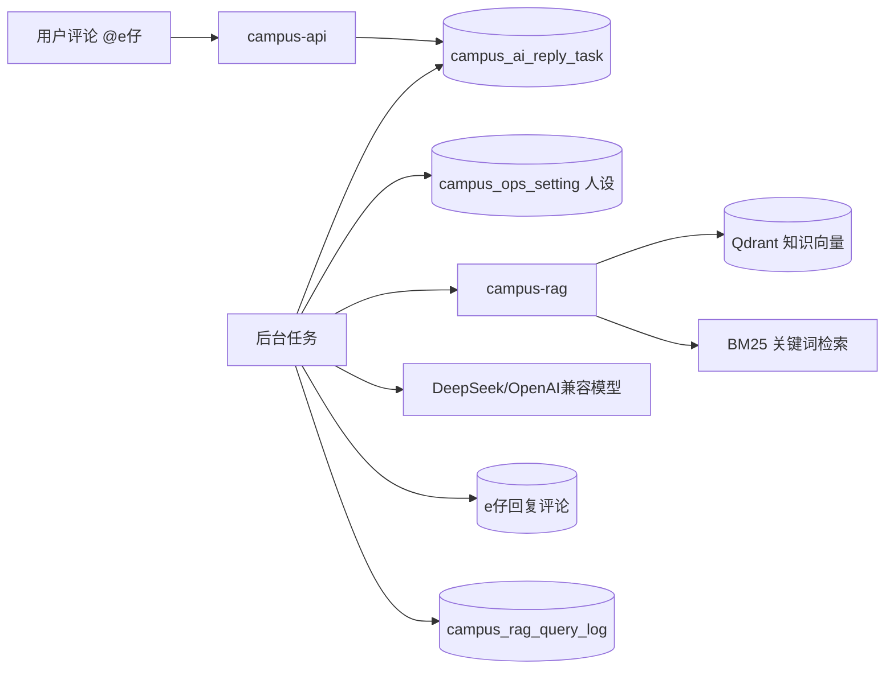
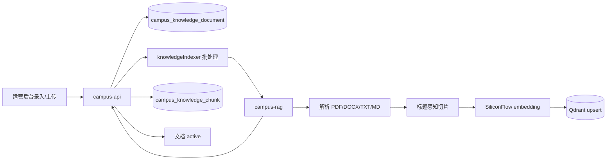
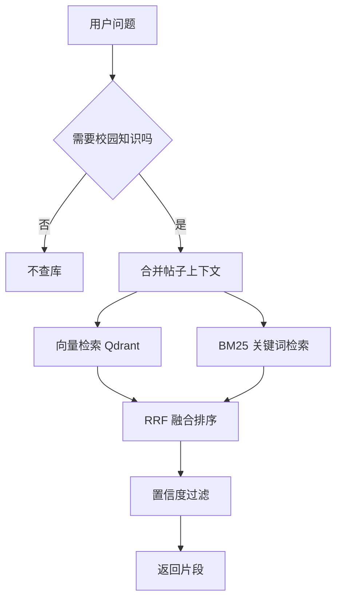
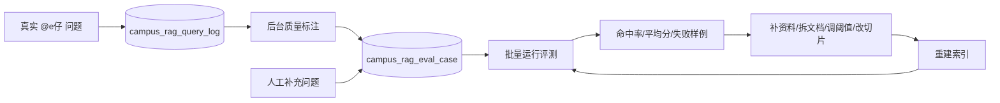
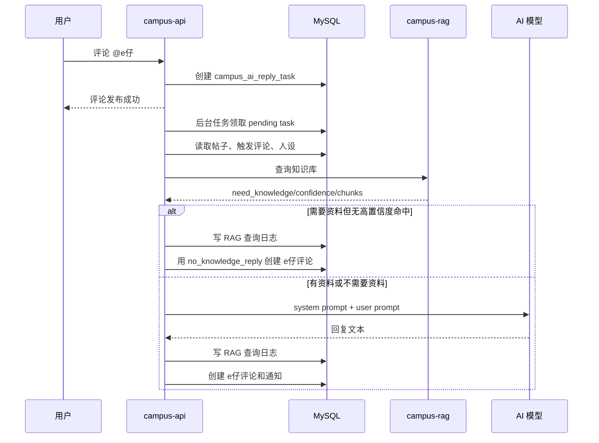

# e仔 AI 与 RAG 知识库设计

这份文档解释校园 e站里“智能 e仔”和本地知识库是怎么设计的。这里的本地知识库不是指小程序本地存储，而是项目自己维护的一套校园资料库：资料元数据存在 MySQL，向量和检索索引存在 Qdrant，由 `campus-rag` 负责解析、切片、embedding 和检索。

## 先建立心智模型

e仔不是直接把用户问题丢给大模型。当前链路是：



简单记：

- `campus-api` 管业务：权限、任务、帖子上下文、人设、prompt、默认回复、评论落库。
- `campus-rag` 管知识库：文档解析、切片、embedding、Qdrant 检索、BM25 检索。
- `Qdrant` 存向量索引，回答时用于语义检索。
- `MySQL` 存文档、片段预览、查询日志、e仔任务和人设配置。
- 大模型只负责生成最后一句自然语言回复，不作为事实源。

## 功能边界

本篇主线有四块能力：

| 能力 | 入口 | 作用 |
| --- | --- | --- |
| e仔自动回复 | 评论区 `@e仔` | 用户在帖子评论区提问后，e仔以官方账号回复 |
| e仔人设 | 运营后台 `/admin/assistant?tab=persona` | 配置名字、角色、性格、语气、安全边界、默认回复 |
| 知识库 | 运营后台 `/admin/assistant?tab=knowledge` | 上传或手动录入校园资料，并索引到 RAG |
| 知识库测试 | 运营后台 `/admin/assistant?tab=test` | 只测试“这个问题会不会查库、命中哪些片段、置信度多少” |
| RAG 评测 | 运营后台 `/admin/assistant?tab=eval` | 保存固定问题集，批量检查召回命中率和置信度 |

后台里“人设预览”和“知识库测试”不是同一个东西：

- 人设预览：模拟评论区 `@e仔` 的完整回答链路，可以选择是否检索知识库、是否真的调用模型，会展示 system prompt、user prompt、最终回复和降级原因。
- 知识库测试：只测检索，不测大模型回复。它主要回答“这条问题能不能从知识库里找到资料”。
- RAG 评测：把真实问题或人工问题固化为回归用例，批量跑检索，观察命中率、平均分、Top 命中片段和失败样例。

### 和 AI 审核的区别

项目里还有一套“AI 发帖审核”，它和 e仔/RAG 是两条链路：

| 能力 | 表 | 是否用 RAG | 作用 |
| --- | --- | --- | --- |
| e仔自动回复 | `campus_ai_reply_task` | 是 | 在评论区回答学生问题 |
| AI/Agent 发帖审核 | `campus_ai_audit_task` | 否 | 对待审核帖子给出 `pass/review/reject` 判断 |

AI/Agent 审核由后台“审核设置”决定是否启用。`campus-api` 只负责任务队列和最终写库，会调用 `campus-agent /internal/moderation/audit` 获取 `decision/confidence/risk_level/reason/evidence`。模型 key 配在 `campus-agent` 的 `CAMPUS_AGENT_*` 或通用 `CAMPUS_AI_*` 里；审核不查知识库，只看帖子类型、标题、正文和图片数量。低风险高置信自动通过，不确定或高风险会保留待审核并推飞书确认。

## 配置项

### e仔回复模型

Go 后端通过 OpenAI Chat Completions 风格接口调用模型，默认按 DeepSeek 配置：

```bash
DEEPSEEK_API_KEY=sk-xxx
CAMPUS_AI_API_KEY=sk-xxx
CAMPUS_AI_BASE_URL=https://api.deepseek.com/chat/completions
CAMPUS_AI_MODEL=deepseek-chat
CAMPUS_AI_DAILY_LIMIT=200
CAMPUS_AI_MAX_OUTPUT_TOKENS=220
CAMPUS_EZAI_BOT_USER_ID=123
CAMPUS_AI_EZAI_ENABLED=true
```

实际启用条件：

- `CAMPUS_AI_API_KEY` 或 `DEEPSEEK_API_KEY` 有值。
- `CAMPUS_EZAI_BOT_USER_ID` 有值，并且这个用户能作为 e仔官方账号发评论。
- `CAMPUS_AI_EZAI_ENABLED` 没有被设置为 `false/off/disabled`。

没满足这些条件时，e仔自动回复不会创建任务，不影响社区其他功能。

### RAG 服务

Go 后端访问 `campus-rag`：

```bash
CAMPUS_RAG_BASE_URL=http://campus-rag:8090
CAMPUS_RAG_TIMEOUT=5s
```

Python `campus-rag` 访问 Qdrant 和 embedding 服务：

```bash
QDRANT_URL=http://qdrant:6333
QDRANT_COLLECTION=campus_knowledge
SILICONFLOW_API_KEY=sk-xxx
SILICONFLOW_BASE_URL=https://api.siliconflow.cn/v1
CAMPUS_RAG_EMBEDDING_MODEL=BAAI/bge-m3
CAMPUS_RAG_CHUNK_SIZE=800
CAMPUS_RAG_CHUNK_OVERLAP=120
CAMPUS_RAG_MIN_CHUNK_CONFIDENCE=0.48
CAMPUS_RAG_BM25_CACHE_TTL=60
CAMPUS_RAG_BM25_MAX_POINTS=5000
CAMPUS_RAG_HTTP_TIMEOUT=20
MINIO_PUBLIC_HOST_REWRITE=localhost:19000=minio:9000
```

`SILICONFLOW_API_KEY` 没配时，知识库索引和向量检索会失败，但社区发帖、评论、后台基础功能仍应可用。

## 人设怎么生效

人设存在 `campus_ops_setting` 表里，后台保存后立即影响后续 e仔回复。

| 配置 key | 含义 |
| --- | --- |
| `ezai_persona_name` | e仔显示身份名，默认 `深汕e仔` |
| `ezai_persona_role` | 角色定位，默认是校园 e站官方内容小伙伴 |
| `ezai_persona_personality` | 性格，例如靠谱、温和、行动派 |
| `ezai_persona_tone` | 回答语气，例如先给结论，再给下一步 |
| `ezai_persona_style_rules` | 风格规则，例如不要列太长清单 |
| `ezai_persona_safety_rules` | 安全边界，例如不编造政策、不冒充学校官方 |
| `ezai_persona_no_knowledge_reply` | 需要资料但知识库没有高置信度命中时的回复 |
| `ezai_persona_fallback_reply` | 模型不可用、模型失败、预览不跑模型时的兜底回复 |
| `ezai_persona_max_reply_chars` | 回复字数，代码会夹在 60 到 220 字之间 |
| `ezai_persona_prompt_version` | prompt 版本号，便于以后灰度和回滚 |

生成 system prompt 时，后端会把人设拼进去：

```text
你是“深汕e仔”，深汕校园e站的官方内容小伙伴，不代表学校官方。
性格：靠谱、温和、行动派，像熟悉校园的学长学姐
语气：先给结论，再给下一步；短句表达，不油腻、不装熟
回答规则：优先围绕帖子上下文回答...
安全边界：不编造学校政策...
场景：用户是在校园 e站某个帖子评论区 @ 你...
回复控制在 140 字以内。
```

如果知识库命中了资料，system prompt 会额外强调“优先依据资料回答”。如果没命中，模型不能被鼓励编造学校事实。

## 知识库怎么设计

知识库分两层存储：

| 层 | 存什么 | 用途 |
| --- | --- | --- |
| MySQL `campus_knowledge_document` | 文档标题、来源、分类、状态、有效期、上传人、错误信息 | 后台管理和状态追踪 |
| MySQL `campus_knowledge_chunk` | 切片内容、摘要、关键词、Qdrant point id | 后台预览和问题排查 |
| Qdrant `campus_knowledge` | 切片向量和 payload | 线上语义检索 |
| MySQL `campus_rag_query_log` | 问题、命中片段、置信度、回答、错误、耗时 | 后台查看最近查询和排障 |
| MySQL `campus_rag_eval_case` | 固定评测问题、期望文档/来源/关键词、最近评测结果 | RAG 回归评测和质量追踪 |

支持两种入库方式：

- 手动录入：运营直接填标题、来源、分类、正文。
- 文件上传：支持 PDF、DOCX、TXT、MD。上传后 `campus-rag` 下载文件、解析文本、切片、embedding。

文档状态：

| 状态 | 含义 |
| --- | --- |
| `draft` | 草稿，不参与检索 |
| `indexing` | 正在索引 |
| `active` | 已启用，参与检索 |
| `disabled` | 已下架，不参与检索 |
| `failed` | 索引失败，需要看错误并重建 |

文档可以设置 `effective_at` 和 `expired_at`。RAG 检索时会过滤未生效或已过期的片段，所以迎新、报到、考试安排这类有时效的信息要尽量填有效期。

## 入库流程



几个关键点：

- `campus-api` 创建文档后先标记 `indexing`。
- `knowledgeIndexer` 批处理调用 `campus-rag`，默认批量处理，单次超时约 90 秒。
- `campus-rag` 会先删除同一文档旧切片，再重新 upsert 新切片，保证重建索引不会混旧数据。
- 索引成功后，MySQL 保存切片预览，文档状态变为 `active`。
- 索引失败后，文档状态变为 `failed`，错误写入 `error_message`，后台可以点“重建”。

## 切片策略

`campus-rag` 不是粗暴按固定字数切。它会先做文本规范化，再尽量识别标题和段落：

- 合并多余空白和空行。
- 识别“须知、指南、流程、安排、说明、时间、地点、材料、路线、FAQ、问答、政策、规则、入口”等标题。
- 对长段落按句子切分，默认 `CAMPUS_RAG_CHUNK_SIZE=800`。
- 长段落切片有默认 `120` 字重叠，减少上下文断裂。
- 每个切片会生成关键词、摘要、有效期、来源、分类等 payload。

对运营来说，最好的资料形态是“一份资料只讲一个主题”，比如：

```text
新生报到材料清单
宿舍入住注意事项
校园网开通流程
快递点和取件时间
军训时间安排
```

不要把大量无关内容塞进一个超长文档里。能拆就拆，命中会更稳定。

## 检索策略

查询流程：



判断是否需要知识库：

- “谢谢 e仔”“哈哈”“收到”这类闲聊不查库。
- 报到、宿舍、校园网、交通、军训、快递、教务、课表、缴费、校园卡等校园事实类问题会查库。
- “这个在哪里办”“能不能申请走读”这类短问题，会结合帖子标题和正文一起判断。

检索细节：

- 默认 `top_k=5`，接口最多允许 10。
- 向量检索会取更宽的候选，约 `top_k * 8`。
- BM25 会从活跃片段里做关键词匹配，并有 60 秒缓存。
- dense 和 sparse 用 RRF 融合排序。
- `CAMPUS_RAG_MIN_CHUNK_CONFIDENCE=0.48` 以下的片段会被过滤。
- Go 后端实际拼进回答 prompt 时，要求最高置信度至少约 `0.52`，并最多取 4 个片段。
- 返回给后台的命中片段会带解释字段：`dense_score`、`sparse_score`、`lexical_overlap`、`rrf_score`。运营可以看出命中主要来自语义相似、关键词匹配还是词面重合。

这意味着“知识库测试里有低分候选”不等于 e仔一定会引用它。e仔回答会更保守。

## RAG 工程闭环

现在这套 RAG 不只是一条查询链路，而是一个可迭代闭环：



### 真实日志

每次 e仔自动回复都会写入 `campus_rag_query_log`：

- 用户问题、帖子和触发评论。
- 是否需要知识库、最终置信度、命中的片段。
- e仔最终回答、模型、耗时、错误信息。
- 人工质量标注：`good / needs_fix / wrong / unsafe`。

这些日志有两个作用：

- 排查线上问题：e仔为什么这么答，命中了哪些资料，是否模型或 RAG 出错。
- 构建评测集：把高频问题、错误问题、边界问题沉淀成固定回归用例。

### 评测集

`campus_rag_eval_case` 保存固定评测问题。每个用例可以设置三类期望：

| 字段 | 含义 |
| --- | --- |
| `expected_document_id` | 最严格，要求命中特定知识库文档 |
| `expected_source` | 要求命中来源包含某个来源名，比如学校官网、教务通知 |
| `expected_keywords` | 要求命中片段包含关键事实词 |

如果三类期望都不填，评测会退化成“看置信度是否足够高”。这适合刚开始资料不多、只想先观察召回质量的阶段。

批量运行评测时，后端会调用现有 RAG Query，不走 e仔大模型，不产生评论。每个用例会记录：

- `last_score`：0 到 1 的评测分。
- `last_hit`：分数大于等于 0.6 视为通过。
- `last_confidence`：RAG 返回的最高置信度。
- `last_result`：本次命中的 Top 片段和错误信息。

### 怎么用它优化知识库

日常运营可以按这个节奏做：

1. 看“回复状态”，把 `wrong`、`unsafe`、`needs_fix` 的真实问题加入评测集。
2. 手动补充一些高频问题，例如宿舍、校园网、快递、报到材料、校车。
3. 每次新增或修改资料后，进入“RAG评测”运行全部评测。
4. 如果命中率下降，先看失败用例的 Top 片段和解释字段。
5. 根据原因处理：

| 失败现象 | 优先处理 |
| --- | --- |
| 没有片段命中 | 补资料或检查文档是否 active/过期 |
| 命中了错误校区资料 | 补 `campus_code` metadata，后续按校区过滤 |
| BM25 高但语义不准 | 拆文档、改标题、增加关键词 |
| dense 高但关键词不匹配 | 提高阈值或加入 reranker |
| 回答编造 | 强化人设安全规则和无资料默认回复 |

### 这块的工程价值

这套闭环的价值在于：每次改 RAG 不再靠“感觉试几句”，而是能用固定用例回归。后续如果要换 embedding 模型、加 reranker、调整切片长度、按校区过滤，都可以先跑评测集，看通过率和失败样例再决定是否上线。

## e仔回复流程



触发条件：

- 评论内容包含 `@深汕e仔`、`＠深汕e仔`、`@e仔` 或 `＠e仔`。
- 发送评论的人不是 e仔官方账号。
- e仔 AI 回复配置已经启用。

幂等设计：

- `campus_ai_reply_task.trigger_comment_id` 有唯一索引，防止同一评论重复创建任务。
- 生成的 e仔回复评论 ID 使用任务 ID，重复处理时能识别已有回复。
- 每天有 `CAMPUS_AI_DAILY_LIMIT` 限额，达到后任务会延后到第二天再试。

## 降级策略

这块很重要，因为 AI/RAG 不能影响社区主链路。

| 场景 | 结果 |
| --- | --- |
| 没有配置 e仔模型 key 或 bot 用户 | 不创建 e仔回复任务 |
| 没有配置 `CAMPUS_RAG_BASE_URL` | RAG client 为 noop，知识库查询等于关闭 |
| 知识库判断不需要资料 | 不强行查库，直接用帖子上下文和模型回答 |
| 需要资料但没有高置信度命中 | 使用 `ezai_persona_no_knowledge_reply`，避免编造 |
| RAG 服务异常 | 记录错误；如果模型可用，会尽量按帖子上下文回答，否则 fallback |
| 模型接口异常或超时 | 使用 `ezai_persona_fallback_reply` |
| 达到每日回复上限 | 任务延后到次日再处理 |
| 触发评论不可见或帖子不存在 | 任务失败并记录错误 |

所以 e仔坏了，最多影响 e仔回答；不应该影响用户发帖、评论、点赞、收藏。

## 后台接口

主要接口都在 `campusservice.go` 注册：

| 接口 | 用途 |
| --- | --- |
| `GET /v1/campus/admin/ai-replies/summary` | e仔状态、模型、bot 账号、RAG 健康、任务统计 |
| `GET /v1/campus/admin/ai-replies/tasks` | 查看 e仔任务 |
| `POST /v1/campus/admin/ai-replies/tasks/{id}/retry` | 重试失败任务 |
| `GET /v1/campus/admin/ezai/persona` | 读取人设 |
| `PUT /v1/campus/admin/ezai/persona` | 保存人设 |
| `POST /v1/campus/admin/ezai/persona/preview` | 预览完整 e仔回复链路 |
| `GET /v1/campus/admin/knowledge/documents` | 知识文档列表 |
| `POST /v1/campus/admin/knowledge/documents` | 创建知识文档 |
| `PUT /v1/campus/admin/knowledge/documents/{id}` | 更新状态、分类、有效期等 |
| `POST /v1/campus/admin/knowledge/documents/{id}/reindex` | 重建索引 |
| `GET /v1/campus/admin/knowledge/documents/{id}/chunks` | 查看切片 |
| `POST /v1/campus/admin/knowledge/test-query` | 只测试知识库检索 |
| `GET /v1/campus/admin/knowledge/query-logs` | 查看 RAG 查询日志 |
| `POST /v1/campus/admin/knowledge/upload` | 上传知识库文件 |

所有后台接口都需要运营权限。

## 运营使用建议

首发阶段建议这样维护知识库：

1. 只录入已经确认的学校信息，不放微信群传言、个人猜测。
2. 每条资料写清楚来源，例如“学校官网通知”“辅导员确认”“运营整理”。
3. 有日期的信息必须填有效期，例如报到、军训、考试安排。
4. 一个文档只讲一个主题，避免“迎新大礼包”式超长混合文档。
5. 每次新增资料后，用“知识库测试”问 2 到 3 个真实问题。
6. 再用“人设预览”跑完整回复，看 e仔语气和默认回复是否合适。
7. 过期资料不要直接删除，先下架或更新后重建索引。

## 排障

后台先看：

- `/admin/assistant?tab=status`：e仔是否启用、bot 是否 ready、今日用量、RAG 健康。
- `/admin/assistant?tab=knowledge`：文档是否 `active`，有没有 `failed`。
- `/admin/assistant?tab=test`：问题是否需要查库、命中哪些片段、置信度多少。
- `/admin/assistant?tab=failed`：失败任务错误原因。

Grafana 常用日志查询：

```logql
{job="docker", container="campus-rag"} |= "error"
{job="docker", container="campus-api"} |= "ezai"
{job="docker", container="campus-api"} |= "knowledge index failed"
{job="docker", container="campus-api"} |= "ai api status"
```

健康检查：

```bash
curl http://localhost:18080/readyz
docker compose exec campus-rag python - <<'PY'
import urllib.request
print(urllib.request.urlopen("http://127.0.0.1:8090/healthz", timeout=3).read().decode())
PY
```

单元测试：

```bash
python campus-rag/test_main.py
go test ./app/campusApi/service/internal/biz -run 'Ezai|RAG|Knowledge'
```

## 已知边界和后续优化

当前设计已经够首发，但还有几个后续可以增强的点：

- 知识库文件第一阶段仍是后台低频文件链路，后续可以迁到私有 COS，和公开图片 COS/CDN 分开。
- `campus_rag_query_log` 首发继续保存在云 MySQL，用于 e仔回复复盘、知识库命中分析和质量标注；数据量变大后再按 30 到 90 天清理。
- 现在 RAG 只返回片段，不在用户侧展示引用来源；后续可以在后台保留引用，在用户侧谨慎展示“资料来源”。
- 当前已经支持 RAG 查询日志人工标注和评测集回归；后续可以继续保存每次评测 run 的历史趋势，而不是只保留最近一次结果。
- 当前是单 collection，后续如果资料规模大，可以按学校、年份、资料类型拆 collection 或加更细分类。
- 现在不做图片理解。图片帖里用户问“图里这个是什么”时，e仔只能依据标题和正文回答。
