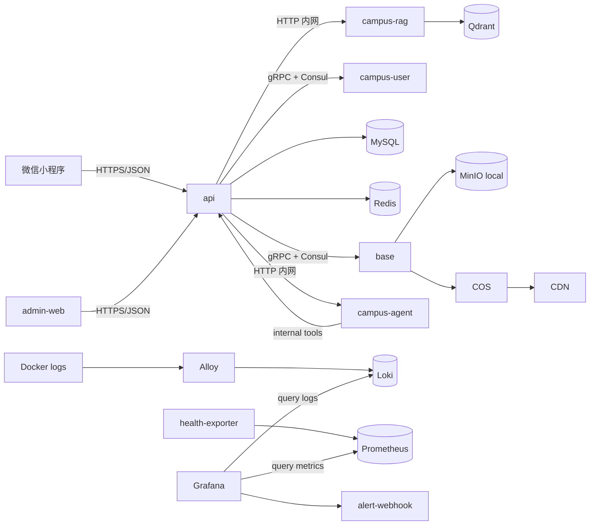

# lehu-campus Architecture

校园 e站当前采用轻量微服务架构：Go Kratos 服务通过 gRPC + Consul 做内部通信，Python `campus-rag` 提供知识库能力，Python `campus-agent` 使用 LangGraph 提供运营 Copilot Agent，观测链路随同一套 Docker 部署。旧项目栈已经从默认项目中移除。

## Design Goals

- 低成本首发：适配轻量服务器，公开图片走 COS + CDN，避免服务器小带宽成为瓶颈。
- 运维简单：服务数量控制在校园业务必要范围内，后台、API、监控都随同一个项目部署。
- 浏览器内排障：健康面板定位组件状态，Grafana/Loki 按 `request_id` 查入口和下游日志。
- 渐进增强：首发只做文字/图片社区；视频、私有文件 COS、业务指标告警后续再按真实流量增加。
- 数据安全：运行中数据库不自动 drop 历史表，新环境只按 `sql/campus.sql` 初始化干净校园表。
- 架构表达：保留 API 网关、基础服务、用户资料服务、AI/RAG 服务的独立容器边界，既利于故障隔离，也便于后续扩展和简历展示。

上线部署见 `docs/deployment-launch.md`；微服务边界见 `docs/microservices.md`；媒体存储见 `docs/media-storage.md`；e仔 AI 和 RAG 知识库见 `docs/ai-rag.md`；观测与飞书告警见 `docs/observability-alerting.md`。

## Services

- `api`: 校园 e站 API 网关和 HTTP 入口，负责 JWT、运营后台、小程序接口、e仔任务编排和健康检查。
- `base`: 账号、验证码、文件签名上传和对象存储确认，本地使用 MinIO，生产公开媒体使用腾讯云 COS + CDN。
- `campus-user`: 用户资料服务，提供创建用户、资料查询/更新、搜索、统计和最后在线时间能力。
- `campus-rag`: 知识库解析、切片、embedding、Qdrant 检索。
- `campus-agent`: 运营 Copilot Agent，使用 LangGraph + LangChain tool 调用 `campus-api` 只读工具接口，生成巡检和治理建议。
- `mysql / redis / minio / qdrant / consul`: 校园业务基础依赖。MinIO 主要用于本地开发和低频内部文件过渡。
- `grafana / loki / alloy / prometheus / health-exporter`: 浏览器内日志搜索和健康监控。

## Runtime Topology

内部通信协议：

- `api -> base`：gRPC，服务发现名 `campus-estation.base.service`。
- `api -> campus-user`：gRPC，服务发现名 `campus-estation.user.service`。
- `api -> campus-rag`：Docker 内网 HTTP，默认 `http://campus-rag:8090`。
- `api -> campus-agent`：Docker 内网 HTTP，默认 `http://campus-agent:8091`。
- `campus-agent -> api`：内部只读工具接口，使用 `X-Campus-Agent-Token`。
- 前端只调用 `api` 的 HTTP 接口，不直接访问内部微服务。

## Data

默认数据库为 `lehu_campus_db`，初始化脚本为 `sql/campus.sql`。首发建议使用同地域、内网连接的 1核1G 云 MySQL；账号、用户、文件、校园社区、通知、审核、安全、e仔/RAG 表全部放同一个云 MySQL，不做双 MySQL 拆库。

核心用户数据、帖子、评论、点赞、收藏、通知、审核、权限、文件记录、e仔/RAG 质量数据都以 MySQL 为最终数据源。普通容器日志走 Loki，不写 MySQL；`campus_access_log` 只保留短期访问记录，生产默认 7 天。

公开媒体首发使用腾讯云 COS + CDN，bucket 和文件域仍保持 `campus`，文件 object key 仍是 `public/{file_id}.{ext}` 这一类格式，不改数据库结构。生产设置 `LEHU_STORAGE_PROVIDER=cos` 后，`base` 会用 COS 生成上传预签名 URL，并把确认后的公开 URL 拼成 `COS_PUBLIC_CDN_BASE_URL/{object_key}`。

本地开发默认 `LEHU_STORAGE_PROVIDER=minio`，继续启动 MinIO。首发只允许文字和图片帖子，后端固定拒绝视频上传和视频帖。

微信小程序生产域名需要同时配置 API request 域名、COS 上传域名和 CDN 下载域名。COS/CDN 控制台需要配置 CORS、回源、缓存规则和基础防盗刷策略。知识库/RAG 文件第一阶段保持后台低频上传链路，后续再单独迁私有 COS。

## Operations

观测与告警的完整使用说明见 `docs/observability-alerting.md`。

健康状态先看 Grafana 的「校园 e站健康监控」；请求排障先用用户给的 `request_id` 在「校园 e站日志搜索」里查入口日志，再用同条日志里的 `trace_id` 搜下游调用。

监控组件分工：

- `Alloy` 只负责采集容器日志并发送给 `Loki`。
- `Loki` 只负责存日志和提供日志查询。
- `health-exporter` 负责探测目标健康状态，包括 HTTP 健康接口和 TCP 依赖。
- `Prometheus` 负责定时抓取并保存 `health-exporter` 暴露出来的健康指标。
- `Grafana` 同时把 `Loki` 和 `Prometheus` 当作数据源：日志搜索查 Loki，健康面板和告警规则查 Prometheus。

所以 Prometheus 不是用来查 request_id 的；查 request_id 用 Loki。Prometheus 主要回答“哪个服务现在 up/down、持续多久、是否应该告警”。

## Core Flows

### Post Publishing

1. 小程序或运营后台提交帖子。
2. 图片先调用 `/v1/campus/upload/presign` 获取上传地址。
3. 客户端直传 MinIO 或 COS。
4. 客户端调用 `/v1/campus/upload/complete` 确认文件。
5. API 写入校园帖子、审核状态和通知相关数据。

### e仔 Reply

1. 用户在评论区 `@e仔`。
2. API 落自动回复任务。
3. 后台任务判断是否需要知识库。
4. 需要校园事实时调用 `campus-rag`，由 Qdrant 返回候选片段。
5. 配合 e仔人设和默认回复策略生成官方账号回复。
6. 模型或 RAG 不可用时降级为默认回复，不阻塞社区主链路。

### Troubleshooting

1. 用户报错时复制 `request_id`。
2. Grafana 日志搜索按 `request_id` 找到入口日志。
3. 如有 `trace_id`，继续搜索同一请求的下游日志。
4. Grafana 健康监控确认 API、MySQL、Redis、RAG、Qdrant 等目标状态。
5. 关键目标 down 时由 Grafana Alerting 经过 `alert-webhook` 推送飞书群。

## Production Defaults

- 默认使用 `docker-compose.yml + docker-compose.prod.yml`。
- 生产只暴露 API、运营后台、Grafana 到宿主机 loopback，外部流量通过反向代理接入 HTTPS。
- MySQL、Redis、Consul、MinIO、Qdrant、Prometheus、base、campus-user 不直接暴露公网。
- `LEHU_ENABLE_LEGACY_UPLOAD=false`，禁止图片上传退回 API 中转。
- `LEHU_ACCESS_LOG_RETENTION_DAYS=7`，避免 `campus_access_log` 在 1核1G 云 MySQL 上无限增长。
- `LEHU_REDIS_CACHE_ENABLED=true`，Redis 用于真实 IP 限流和短 TTL 热点读缓存；验证码能力保留在旧账号基础服务里，小程序主链路不依赖它。
- Docker json log 使用大小和份数限制；长期排障以 Loki 留存为准。
