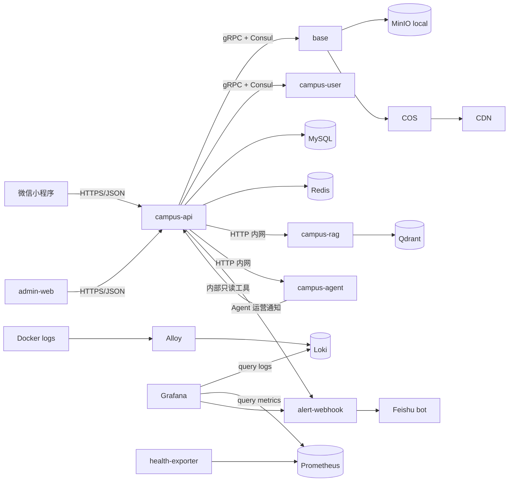

# 校园 e站开发者导览

这份文档写给第一次接手本项目的人。项目经历过从旧短视频系统到“校园 e站”的重构，所以代码里还保留少量历史命名，例如 Go module 仍是 `lehu-video`。当前产品边界已经收口为校园社区、小程序、运营后台、e仔/RAG、监控与告警，并保留轻量微服务架构。

## 先建立心智模型

校园 e站不是一个短视频产品。第一阶段只做文字/图片校园社区，不开放视频，不做 IM chat，不跑 Kafka。后端采用轻量微服务拆分，核心服务通过 Docker 容器独立运行。

核心思路：

- 小程序是学生端，负责浏览、发帖、评论、收藏、反馈、通知、课表和 e仔互动。
- 运营后台是运营端，负责内容供给、审核、反馈举报、用户权限、e仔人设、知识库、朋友圈素材和系统通知。
- Go 后端按职责拆分为 `campus-api`、`base`、`campus-user`，其中 `campus-api` 是 API 网关和业务编排层。
- `campus-api` 通过 gRPC + Consul 调用 `base` 和 `campus-user`。
- Python `campus-rag` 只负责知识库解析、embedding 和向量检索。
- Python `campus-agent` 是运营值班 Agent，负责巡检、治理建议、RAG 缺口分析和发帖初审判断。
- 公开图片生产走 COS + CDN，不走服务器本机带宽。
- Grafana 是统一排障入口：Loki 查日志，Prometheus 看健康和告警。

## 推荐阅读顺序

1. `README.md`：启动、生产配置、监控和告警。
2. `docs/product-feature-design.md`：从产品视角理解学生端、运营后台、e仔、Agent 和首发边界。
3. `docs/developer-guide.md`：当前这份文档，理解项目怎么设计。
4. `docs/architecture.md`：更偏架构图和运行拓扑。
5. `docs/microservices.md`：理解微服务边界、gRPC/Consul 和不继续拆的原因。
6. `docs/resume-highlights.md`：把项目整理成简历和面试表达。
7. `docs/deployment-launch.md`：上线部署、环境变量、验收和常见问题。
8. `docs/release-strategy.md`：没有测试环境时怎么发布、回滚和演进轻量蓝绿。
9. `docs/media-storage.md`：COS/CDN、MinIO、本地和生产上传链路。
10. `docs/data-model.md`：核心表和数据流。
11. `docs/api-map.md`：HTTP 路由按功能分组。
12. `docs/admin-operations.md`：运营后台页面和日常工作流。
13. `docs/ai-rag.md`：专门理解 e仔 AI、本地知识库和 RAG 检索。
14. `docs/observability-alerting.md`：专门理解 Grafana、Loki、Alloy、Prometheus 和飞书告警。
15. `docs/agent-copilot.md`：理解运营值班 Agent、飞书主动提醒和 AI 成本保护。
16. `docs/wechat-submission.md`：小程序提审、隐私和社区规范。
17. `docker-compose.yml` / `docker-compose.prod.yml`：理解本地与生产差异。
18. `app/campusApi/service/internal/service/campusservice.go`：看 HTTP 路由总入口。
19. `app/campusApi/service/internal/biz/campus.go`：看校园业务主用例。
20. `sql/campus.sql`：看新库表结构。
21. `web/admin/src/App.jsx`：看运营后台页面入口。

## 目录怎么读

```text
api/                         Kratos proto 和生成代码
app/base/                    账号、验证码、文件上传、对象存储确认
app/campusUser/              用户资料服务
app/campusApi/               小程序和运营后台 HTTP 入口、校园业务编排
campus-rag/                  RAG 文档解析、切片、embedding、Qdrant 查询
cmd/healthcheck/             Docker healthcheck 小工具
deploy/config/               各 Go 服务配置
deploy/observability/        Grafana、Loki、Alloy、Prometheus、告警桥接
docs/                        给人看的架构和开发文档
scripts/                     冒烟测试、日志检索脚本
sql/                         初始化 SQL 和历史增量 SQL
web/admin/                   运营后台 React 应用
```

当前最重要的后端目录是：

```text
app/campusApi/service/internal/service/campusservice.go
app/campusApi/service/internal/biz/campus.go
app/campusApi/service/internal/data/campus.go
```

可以粗略理解为：

- `service`：HTTP 参数解析、鉴权包装、响应输出。
- `biz`：业务规则和流程编排。
- `data`：数据库访问、外部服务适配。

目前 API 的真实入口以 `campusservice.go` 里的 `RegisterRoutes` 和 proto 生成的用户/文件服务为准。根目录 `openapi.yaml` 里仍有 Kratos 模板残留，阅读接口时不要把它当作唯一事实来源。

## 运行架构



### 服务职责

| 服务 | 作用 | 人类开发时重点看 |
| --- | --- | --- |
| `api` | 小程序和运营后台 HTTP 入口，校园业务、审核、通知、e仔任务、朋友圈素材 | `campusservice.go`、`campus.go`、`campus.go` data |
| `base` | 账号、验证码、文件预签名上传、MinIO/COS provider | `app/base/service/internal/biz/file.go`、`data/cos.go` |
| `campus-user` | 用户资料、资料查询、搜索、统计、在线时间 | `app/campusUser/service/internal/*` |
| `campus-rag` | 文档解析、切片、embedding、Qdrant 检索 | `campus-rag/main.py` |
| `campus-agent` | LangGraph 运营值班 Agent、巡检、治理建议、发帖初审判断 | `campus-agent/main.py` |
| `admin-web` | 运营后台 | `web/admin/src/pages/Admin/*` |
| `health-exporter` | 探测各组件健康状态，暴露给 Prometheus | `deploy/observability/health-exporter/*` |
| `alert-webhook` | Grafana 告警和值班 Agent 运营通知转飞书群机器人消息 | `deploy/observability/alert-webhook/*` |

## 核心业务模块

### 账号与登录

学生端主要走微信登录：

```text
POST /v1/auth/wechat-login
```

本地开发可以用 mock 登录，生产必须配置真实微信小程序：

```text
WECHAT_APP_ID
WECHAT_APP_SECRET
LEHU_WECHAT_MOCK_LOGIN=false
```

运营后台走账号密码登录：

```text
POST /v1/user/login
```

后台权限由 `campus_operator` 表和环境变量共同控制：

```text
LEHU_CAMPUS_ADMIN_USER_IDS
LEHU_CAMPUS_OPERATOR_USER_IDS
```

生产不要开启：

```text
LEHU_CAMPUS_ADMIN_ALLOW_ALL=true
```

### 社区与内容

帖子只支持：

```text
media_type = text | image
```

视频被后端固定拒绝。不要重新打开视频入口，除非同时补齐带宽、CDN、防刷、审核和成本控制方案。

常用表：

```text
campus_forum_category
campus_forum_post
campus_forum_comment
campus_forum_post_like
campus_forum_post_collection
campus_forum_report
```

常用接口在：

```text
/v1/campus/forum/**
/v1/campus/admin/posts/**
/v1/campus/admin/comments/**
/v1/campus/admin/reports/**
```

### 媒体上传

生产公开图片不经过 API 服务器中转：

```text
客户端 -> /v1/campus/upload/presign -> COS/MinIO 直传 -> /v1/campus/upload/complete
```

本地默认：

```text
LEHU_STORAGE_PROVIDER=minio
```

生产默认：

```text
LEHU_STORAGE_PROVIDER=cos
COS_SECRET_ID
COS_SECRET_KEY
COS_REGION
COS_BUCKET
COS_PUBLIC_CDN_BASE_URL
```

`/v1/campus/upload/image` 是旧的图片中转 fallback，生产应保持关闭：

```text
LEHU_ENABLE_LEGACY_UPLOAD=false
```

### 审核

审核模式存在 `campus_ops_setting`，后台页面是“审核设置”。

模式：

```text
off     不审核，用户发帖直接展示
manual  人工审核
ai      AI 初审，运营复核
```

新库初始化默认是 `ai`。用户发帖后接口立即返回；公共首页只展示已通过帖子，作者本人可在详情和“我的帖子”看到同步中的内容。小程序应优先展示 `publish_state/client_status_label/client_status_detail`，不要直接展示后台审核原因。

`/admin/audit` 还包含值班 Agent 开关。`Agent 模型能力` 会控制手动 Copilot、每日巡检和 AI 初审是否调用模型；`AI/Agent 初审` 关闭时，`post_audit_mode=ai` 会自动退化为人工待审；`飞书运营通知` 关闭时，举报、反馈、审核待确认、日报和高风险提醒都不再发飞书。环境变量只作为默认值，后台保存后以 `campus_ops_setting` 为准。

审核链路做了成本保护：本地规则判断为低风险时不调模型、不发飞书，直接公开；只有中风险、不确定或高风险内容才进入 Agent。模型预算超限或 Agent 不可用时，低风险照常公开，其他内容保持作者可见、公共不可见，并推飞书或进入后台人工处理。

相关接口：

```text
GET /v1/campus/admin/settings/audit
PUT /v1/campus/admin/settings/audit
GET /v1/campus/admin/settings/agent
PUT /v1/campus/admin/settings/agent
GET /v1/campus/admin/ai-usage/summary
GET /v1/campus/admin/ai-usage/logs
```

举报闭环由 `campus-api` 统一发站内消息：用户提交举报后收到“举报已收到”，后台或飞书按钮处理后收到克制结果。指定用户系统消息必须带 `recipient_id`，只有后台群发通知才使用 `audience=all_users`。

飞书提醒默认行为：

- 举报帖子/评论：默认即时推飞书。
- `contact/cooperation/bug/content` 反馈：默认即时推飞书。
- 普通 `suggestion`：默认不即时推，进入后台和日报。
- 审核不确定/高风险、AI 预算预警：默认推飞书。

### e仔与 RAG

完整设计、入库流程、检索策略、人设 prompt 和降级策略见 `docs/ai-rag.md`。

e仔由三部分组成：

1. 人设配置：名字、身份、性格、语气、回答规则、默认回复。
2. 知识库：学校官方资料、运营手动录入资料、切片和查询日志。
3. 自动回复任务：用户评论区 `@e仔` 后生成任务，后台任务处理。

相关表：

```text
campus_ai_reply_task
campus_knowledge_document
campus_knowledge_chunk
campus_rag_query_log
campus_ops_setting
```

相关后台页面：

```text
/admin/assistant?tab=status
/admin/assistant?tab=persona
/admin/assistant?tab=knowledge
/admin/assistant?tab=test
```

AI 没配时应降级，不应该影响社区主链路。

### 朋友圈九图素材

这个功能不自动发朋友圈，因为普通微信号/小程序没有开放后台自动发朋友圈能力。当前设计是后台生成素材包：

```text
9 张 1080x1080 图片 + 小程序码 + 文案 + ZIP 下载
```

相关接口：

```text
GET  /v1/campus/admin/moments/candidates
POST /v1/campus/admin/moments/packages
GET  /v1/campus/admin/moments/packages/{id}/images/{slot}.png
GET  /v1/campus/admin/moments/packages/{id}/download.zip
```

生成文件放临时目录，默认 24 小时清理，不长期写 COS。

## 数据库设计

新环境只用：

```text
sql/campus.sql
```

默认库名：

```text
lehu_campus_db
```

表可以按业务分组看：

| 分组 | 表 |
| --- | --- |
| 账号和用户 | `account`、`user`、`campus_wechat_identity`、`campus_profile`、`campus_operator` |
| 文件 | `file`、`file_campus_*` 分片表 |
| 社区 | `campus_forum_category`、`campus_forum_post`、`campus_forum_comment`、点赞收藏举报表 |
| 反馈通知 | `campus_feedback`、`campus_notification`、`campus_notification_outbox` |
| e仔/RAG | `campus_ai_reply_task`、`campus_knowledge_document`、`campus_knowledge_chunk`、`campus_rag_query_log`、`campus_rag_eval_case` |
| 审核与安全 | `campus_ops_setting`、`campus_ai_audit_task`、`campus_ai_usage_log`、`campus_ops_alert`、`campus_ops_action_token`、`campus_access_log`、`campus_ip_block`、`campus_audit_log` |
| 埋点 | `campus_event` |

运行中的老库不要自动 drop 历史表。需要清理时，先备份、确认、再人工执行。

## 运营后台设计

后台不是营销页，应该保持高密度、可扫描、少解释。

主要入口：

```text
/admin                  数据总览
/admin/posts            内容工作台
/admin/compose          运营发帖
/admin/moments          朋友圈素材
/admin/moderation       反馈与举报
/admin/audit            审核设置
/admin/copilot          运营值班 Agent
/admin/assistant        e仔助手
/admin/notifications    系统通知
/admin/security         安全中心
/admin/users            用户管理
/admin/permissions      权限管理
```

前端请求封装：

```text
web/admin/src/utils/request.js
web/admin/src/api/admin.js
web/admin/src/api/user.js
```

后台页面组件：

```text
web/admin/src/pages/Admin/*.jsx
web/admin/src/pages/Admin/Admin.css
```

改后台 UI 时优先遵守：

- 页面顶部只保留一层标题。
- 卡片只用于模块、列表项、弹窗，不要卡片套卡片。
- 文案短，突出状态、数量、动作。
- 操作按钮靠近对应数据。
- 移动端不能文字溢出或按钮重叠。

## 监控和排障

完整配置、健康目标、告警规则和飞书测试方式见 `docs/observability-alerting.md`。

日志链路：

```text
Docker logs -> Alloy -> Loki -> Grafana
```

健康链路：

```text
health-exporter -> Prometheus -> Grafana
```

告警链路：

```text
Grafana Alerting -> alert-webhook -> 飞书群机器人
```

排障顺序：

1. 用户报错时复制 `request_id`。
2. Grafana 的“校园 e站日志搜索”按 `request_id` 查日志。
3. 如果接口返回 500，继续按接口路径、服务名、`trace_id` 查。
4. Grafana 的“校园 e站健康监控”看哪个组件 down，包括 API、RAG、Agent、飞书桥接和核心依赖。
5. 飞书告警只处理 P0/P1，避免上线初期噪音太多。

常用本地命令：

```bash
make logs-request RID=web-xxx SINCE=30m
make logs-search Q="/v1/campus/forum/posts" SINCE=2h
curl http://localhost:18080/readyz
docker compose ps
```

## 本地开发流程

启动：

```bash
docker compose up -d --build
```

后台：

```text
http://localhost:15173/admin
```

API：

```text
http://localhost:18080
```

Go 测试：

```bash
go test ./...
```

后台构建：

```bash
npm --prefix web/admin run build
npm --prefix web/admin run lint
```

冒烟测试：

```bash
API_BASE=http://127.0.0.1:18080/v1 ./scripts/smoke.sh
```

## 生产上线要点

生产使用：

```bash
docker compose --env-file .env.production -f docker-compose.yml -f docker-compose.prod.yml up -d --build
```

上线前必须确认：

- `.env.production` 里没有占位符。
- `LEHU_CAMPUS_ADMIN_USER_IDS` 已设置。
- `LEHU_CAMPUS_ADMIN_ALLOW_ALL=false`。
- `LEHU_WECHAT_MOCK_LOGIN=false`。
- `LEHU_STORAGE_PROVIDER=cos`。
- `LEHU_ENABLE_LEGACY_UPLOAD=false`。
- API、运营后台、Grafana 通过反向代理暴露 HTTPS。
- 微信公众平台配置 API request 域名、COS 上传域名、CDN 下载域名。
- Grafana 飞书告警 token/webhook 配好。
- `campus_access_log` 保留期合理，首发生产默认 7 天。

## 改需求时该从哪里下手

| 需求 | 优先看 |
| --- | --- |
| 新增小程序接口 | `campusservice.go` 路由、`biz/campus.go`、`data/campus.go` |
| 新增后台页面 | `web/admin/src/App.jsx`、`AdminLayout.jsx`、`api/admin.js` |
| 新增运营后台接口 | `/v1/campus/admin/**` 路由和 `campusAdminApi` |
| 改发帖审核 | `campus_ops_setting`、审核设置接口、发帖创建逻辑 |
| 改 e仔人设 | `AdminEzaiPersona.jsx`、`campus_ops_setting`、e仔预览接口 |
| 改知识库 | `campus-rag/main.py`、知识库 admin 接口、Qdrant 配置 |
| 改文件上传 | `base` 文件服务、COS provider、上传 presign/complete |
| 改监控告警 | `deploy/observability/*` |
| 改上线配置 | `.env.production.example`、`docker-compose.prod.yml` |
| 改发布流程 | `docs/release-strategy.md`、`scripts/release-check.sh`、反向代理配置 |

## 人类接手 AI 代码时的安全做法

- 先用 `rg` 搜入口，不要凭文件名猜实现在哪里。
- 先看 `service -> biz -> data` 三层，再决定改哪层。
- 每次只改一个明确问题，避免顺手重构把线上行为改掉。
- 数据库新增字段时，优先同步 `sql/campus.sql` 和单独迁移 SQL。
- 生产配置改动同时检查 `.env.production.example`、`docker-compose.prod.yml` 和 README。
- 后台 UI 改动后至少跑 `npm --prefix web/admin run build` 和 `npm --prefix web/admin run lint`。
- 后端改动后至少跑相关包测试；跨服务改动再跑 `go test ./...`。
- 不确定某张表是否还能删时，默认不要删运行中数据库，只更新新库初始化脚本。

## 当前值得保留的设计

- 公开媒体走 COS + CDN，避免服务器带宽被图片拖垮。
- 后台随主项目部署，减少多仓库、多 compose 的心智负担。
- RAG 与主 API 分离，AI/RAG 出问题时不影响社区基础功能。
- Grafana/Loki/Prometheus/Alloy 保留，便于不用 SSH 也能查日志和健康状态。
- 视频关闭，降低审核、成本和刷流量风险。

## 当前技术债和改进建议

这些不是马上阻塞上线的问题，但以后可以逐步处理：

- Go module 仍叫 `lehu-video`，目录已经校园化。短期不建议强改 module，后续稳定后再做全量改名。
- `campusApi` 的 `campus.go` 和 `campusservice.go` 偏大。功能稳定后可以按社区、后台、e仔、知识库、通知拆文件。
- `api/helloworld` 仍是 Kratos 模板残留，可以后续删除，降低误导。
- 本地 compose 仍启动 MinIO；生产公开媒体不用 MinIO。后续如果 RAG 文件也迁私有 COS，可以考虑生产不启动 MinIO。
- 业务指标告警暂时只做健康类。等真实用户稳定后，再加 5xx 率、上传失败率、AI 失败率等业务告警。
- `campus_access_log` 写云 MySQL，已经有 7 天保留期清理；流量变大后可考虑只保留异常/限流/封禁摘要，普通请求继续依赖 Loki。
- 首发不要拆双 MySQL。核心业务表、文件记录、审核权限和 e仔/RAG 质量数据统一在云 MySQL；如果 1核1G 云 MySQL 出现持续 CPU 或慢查询压力，优先升级到 2核4G 云 MySQL。

## 一句话总结

校园 e站的核心不是“堆很多服务”，而是把小程序社区、运营后台、媒体存储、e仔知识库和浏览器内排障整合成一套首发可控、成本可控、后续能渐进扩展的系统。
