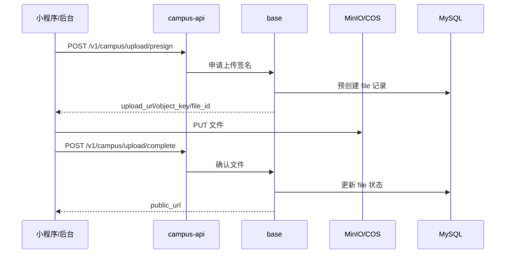

# 媒体存储与 COS/CDN

这份文档解释校园 e站的图片和文件为什么这样设计，以及本地 MinIO、生产 COS/CDN、上传接口之间的关系。

## 设计结论

生产公开媒体不走轻量服务器本机带宽。

```text
小程序/后台 -> API 获取预签名 URL -> 直传 COS -> complete -> CDN 公开访问
```

本地开发继续用 MinIO：

```text
小程序/后台 -> API 获取预签名 URL -> 直传 MinIO -> complete -> MinIO 本地访问
```

这样做的原因是轻量服务器带宽很小，图片流量如果走 API 服务器，会把普通 JSON 请求一起堵住。COS + CDN 把图片上传和下载从 API 服务器剥离出去，服务器只负责签名、鉴权和写数据库。

## 存储 provider

后端 `base` 服务支持：

```bash
LEHU_STORAGE_PROVIDER=minio
LEHU_STORAGE_PROVIDER=cos
```

本地默认：

```bash
LEHU_STORAGE_PROVIDER=minio
LEHU_PUBLIC_MINIO_ENDPOINT=localhost:19000
```

生产默认：

```bash
LEHU_STORAGE_PROVIDER=cos
COS_SECRET_ID=...
COS_SECRET_KEY=...
COS_REGION=ap-guangzhou
COS_BUCKET=campus-1250000000
COS_PUBLIC_CDN_BASE_URL=https://cdn.example.com
```

`LEHU_STORAGE_PROVIDER=cos` 时，缺少 COS 或 CDN 配置应该直接视为生产配置错误。

## 上传链路

公开图片上传固定走三步：



接口形态不因为 provider 改变：

| 接口 | 用途 |
| --- | --- |
| `POST /v1/campus/upload/presign` | 获取直传 URL |
| `POST /v1/campus/upload/complete` | 上传完成后确认 |
| `POST /v1/campus/upload/image` | 旧中转 fallback，生产关闭 |

生产必须保持：

```bash
LEHU_ENABLE_LEGACY_UPLOAD=false
```

`/v1/campus/upload/image` 只用于旧客户端兼容或本地调试。生产打开它会让图片重新经过 API 服务器，违背成本和带宽设计。

## 文件域和 object key

当前公开媒体使用：

```text
domain_name=campus
biz_name=public
```

object key 继续保持类似：

```text
public/{file_id}.{ext}
```

帖子图片、头像、反馈图片、运营发帖图片都走这套公开媒体链路。

## CDN URL 生成

生产 `complete` 后返回：

```text
https://cdn.example.com/{object_key}
```

也就是：

```text
COS_PUBLIC_CDN_BASE_URL + "/" + object_key
```

前端展示图片只用 CDN URL，不用 COS 源站 URL，也不用服务器 URL。

## 腾讯云控制台配置

COS bucket：

- 创建 bucket，例如 `campus-1250000000`。
- 开启 CORS，允许小程序和后台域名 `PUT/GET/HEAD`。
- 不要把永久密钥写进小程序或前端。
- 生产密钥只放后端环境变量。

CDN：

- 源站指向 COS bucket。
- 绑定下载域名，例如 `cdn.example.com`。
- 图片缓存可先设置较长 TTL。
- 建议开启基础防盗链或 Referer 规则。
- 后续如果流量异常，再加频控、鉴权 URL 或图片处理策略。

微信公众平台：

| 配置 | 域名 |
| --- | --- |
| request 合法域名 | API 域名 |
| uploadFile 合法域名 | COS 上传域名 |
| downloadFile 合法域名 | CDN 下载域名 |

COS 上传域名通常类似：

```text
https://campus-1250000000.cos.ap-guangzhou.myqcloud.com
```

## MinIO 的位置

MinIO 现在主要用于：

- 本地开发。
- 低频内部文件过渡。
- RAG 知识库文件的本地调试链路。

生产公开图片不再依赖 MinIO。生产 compose 默认也不会启动 MinIO；只有显式启用 `local-stateful` profile 并切回 MinIO provider 时才会启动本地 MinIO。

## RAG 文件和公开图片的区别

公开图片：

- 给所有用户看。
- 走 COS + CDN。
- 需要配置微信 downloadFile 域名。

RAG 知识库文件：

- 给后台和 `campus-rag` 处理。
- 第一阶段不做公开 CDN 化。
- 更像内部资料源，后续适合迁私有 COS。

不要把 RAG 私有资料当公开图片处理。

## 视频策略

首发固定关闭视频：

- 小程序没有视频入口。
- 后端只接受 `text/image`。
- 视频上传和视频帖返回错误。

原因不是接口做不到，而是视频会带来带宽、审核、存储、防刷和成本风险。等有真实运营需求后，再单独设计视频灰度、防刷、限额和预算。

## 排障

| 现象 | 优先看 |
| --- | --- |
| presign 报错 | provider 配置、COS 密钥、bucket |
| 小程序 PUT 失败 | COS CORS、微信 uploadFile 域名 |
| complete 后图片打不开 | CDN 回源、`COS_PUBLIC_CDN_BASE_URL`、object key |
| 本地图片打不开 | MinIO 是否启动、bucket 是否 public |
| 服务器出网被图片打满 | 是否误开 `LEHU_ENABLE_LEGACY_UPLOAD=true` |

Grafana 搜索：

```logql
{job="docker", container="campus-base"} |= "storage_provider"
{job="docker"} |= "/v1/campus/upload/presign"
{job="docker"} |= "/v1/campus/upload/complete"
```
