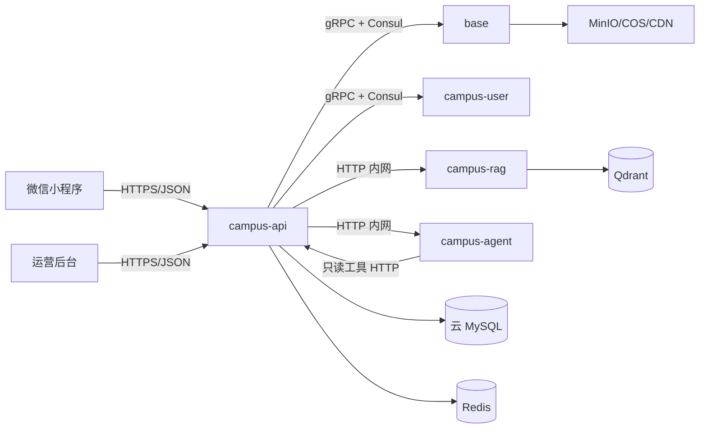

# 校园 e站微服务边界

校园 e站首发保留轻量微服务架构。所有服务可以部署在同一台轻量服务器上，但仍然是独立容器、独立进程、独立健康检查和独立日志流。微服务的价值不只在多机器部署，也在服务边界、故障隔离、内部通信和可观测性。

## 当前服务拆分



| 服务 | 边界 | 通信 |
| --- | --- | --- |
| `campus-api` | API 网关、JWT、运营后台、小程序接口、校园社区、审核、通知、e仔任务编排 | 对外 HTTP；对内 gRPC/HTTP |
| `base` | 账号、验证码、文件预签名、对象存储确认、COS/MinIO provider | gRPC，被 `campus-api` 调用 |
| `campus-user` | 用户资料、用户搜索、批量查询、统计、最后在线时间 | gRPC，被 `campus-api` 调用 |
| `campus-rag` | 文档解析、切片、embedding、BM25/向量检索、Qdrant 访问 | HTTP，被 `campus-api` 调用 |
| `campus-agent` | LangGraph 运营值班 Agent、工具调用、巡检/治理/知识库缺口建议、发帖初审判断 | HTTP，被 `campus-api` 调用 |
| `admin-web` | 运营后台静态站点 | HTTP，经反代访问 `campus-api` |

`base` 和 `campus-user` 通过 Consul 注册服务名：

```text
campus-estation.base.service
campus-estation.user.service
```

`campus-api` 使用 `discovery:///...` 形式通过 Consul 发现 gRPC 服务。`campus-rag` 不走 Consul，使用 Docker 内网地址 `http://campus-rag:8090`。

## 为什么保留这几个服务

- `campus-api` 作为 API 网关，隔离前端和内部服务，避免小程序/后台直接感知 gRPC。
- `base` 把账号和文件能力独立出来，文件上传、COS/CDN、MinIO 本地开发都集中在一个基础服务里。
- `campus-user` 把用户资料从社区业务里抽出来，便于用户主页、搜索、统计和后续多校区身份扩展。
- `campus-rag` 使用 Python、embedding、Qdrant 和模型接口，技术栈天然不同，独立容器最合理。
- `campus-agent` 使用 Python、LangGraph 和 LangChain tool，独立成 Agent 服务能清晰表达工具调用、人机确认和只读权限边界。
- 观测链路可以按容器和服务名查日志、看健康、发告警，适合项目上线和简历表达。

## 暂不继续拆的模块

首发不再拆 `forum-service`、`comment-service`、`notification-service`、`audit-service`。这些能力目前统一留在 `campus-api`：

- 帖子、评论、点赞收藏强相关，拆开会增加事务和一致性复杂度。
- 通知、审核、举报、朋友圈素材都依赖社区数据，首发放在同一业务编排层更稳。
- 只有一台服务器时，过度拆分会增加容器数量、内存占用、日志噪音和排障成本。

后续如果真实流量增长，可以优先拆“通知投递”和“内容审核任务”这类异步能力，而不是先拆帖子主链路。

## 简历表达口径

可以描述为：

> 基于 Go Kratos + gRPC + Consul 构建校园社区轻量微服务系统，拆分 API 网关、账号文件服务、用户资料服务、AI/RAG 服务和 LangGraph 运营 Agent 服务；使用 Redis 缓存热点读和限流，COS/CDN 承载公开媒体，Grafana + Loki + Prometheus + Alloy 实现日志搜索、健康监控和飞书告警。

不要描述为“单体项目”。也不建议继续叫“短视频架构”，当前产品和文档统一叫“校园 e站微服务架构”。
