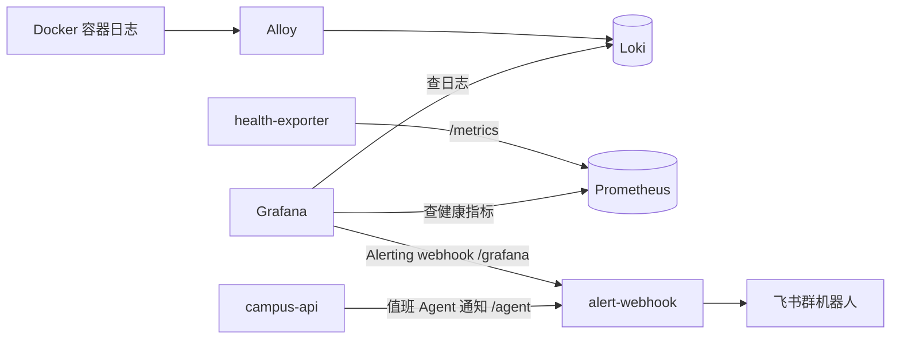

# 校园 e站观测与告警

这份文档专门解释校园 e站的 Grafana、Loki、Alloy、Prometheus、health-exporter 和飞书告警。它的目标是让人不用进服务器翻容器，也能在浏览器里先判断“哪里坏了”和“为什么坏了”。

## 先建立心智模型

这套系统分三条链路：



可以简单记：

- 查 `request_id`、接口报错、业务日志：看 Grafana 的 Loki 日志。
- 看 `up/down`、哪个组件挂了、是否触发告警：看 Grafana 的 Prometheus 健康面板。
- 收手机通知：Grafana Alerting 和运营值班 Agent 都通过 `alert-webhook` 发到飞书群。

这套不是 APM，也不是链路追踪平台。现在先解决首发最重要的问题：服务挂了能知道，用户报错能按 `request_id` 快速定位，运营日报和高风险提醒能自动到飞书。

## 组件分工

| 组件 | 作用 | 主要配置 |
| --- | --- | --- |
| `Grafana` | 浏览器入口，展示日志、健康面板和告警规则 | `deploy/observability/grafana/provisioning/` |
| `Loki` | 存容器日志，给 Grafana 查询 | `deploy/observability/loki/config.yaml` |
| `Alloy` | 从 Docker 采集容器日志，推送到 Loki | `deploy/observability/alloy/config.alloy` |
| `Prometheus` | 抓取健康指标并保存，给 Grafana 告警查询 | `deploy/observability/prometheus/prometheus.yml` |
| `health-exporter` | 主动探测 HTTP/TCP 目标，把结果暴露成 Prometheus 指标 | `deploy/observability/health-exporter/` |
| `alert-webhook` | 接收 Grafana 告警和值班 Agent 运营通知，转换为飞书消息 | `deploy/observability/alert-webhook/alert_webhook.py` |
| 飞书群机器人 | 真正把告警发到手机/电脑飞书 | 飞书群自定义机器人配置 |

## 本地和生产入口

本地默认地址：

| 服务 | 地址 | 用途 |
| --- | --- | --- |
| Grafana | `http://localhost:13002` | 日志搜索、健康面板、告警 |
| Prometheus | `http://localhost:19090` | 调试健康指标和告警表达式 |
| API | `http://localhost:18080` | 业务接口 |
| 运营后台 | `http://localhost:15173/admin` | 内容和运营管理 |

生产使用 `docker-compose.yml + docker-compose.prod.yml`。生产覆盖文件会把 Grafana 绑定到宿主机 loopback：

```text
127.0.0.1:${GRAFANA_HOST_PORT:-13002}:3000
```

也就是说生产建议用 Caddy/Nginx 反向代理提供 HTTPS；不要直接把 Grafana、Prometheus、Loki、MySQL、Redis 暴露到公网。
API 域名反代时要显式拒绝 `/v1/campus/internal/*`，避免把 Prometheus 指标和 Agent 内部工具路径暴露到公网；飞书按钮回调 `/v1/campus/feishu/card/callback` 不在该路径下，需要保持公网 HTTPS 可访问。

## Grafana 里看什么

预置目录：

```text
Dashboards -> Campus e站
```

预置面板：

| 面板 | 用途 |
| --- | --- |
| `校园 e站日志搜索` | 按容器、`request_id`、`trace_id`、接口路径、错误关键词查日志 |
| `校园 e站健康监控` | 看 API、MySQL、Redis、RAG、Qdrant 等目标是否 up/down |
| `校园 e站值班 Agent` | 看 Agent 运行、AI 成本、审核决策、飞书队列和 SLA 超时 |

日志搜索面板的底层查询大致是：

```logql
{job="docker", container=~"$container"} |= "$keyword"
```

健康面板查询的是 Prometheus 指标，例如：

```promql
campus_probe_success
campus_probe_duration_seconds
```

值班 Agent 面板查询 `campus-api` 暴露的内部运营指标，例如：

```promql
campus_agent_runs_total
campus_ai_cost_cny
campus_ops_alerts
campus_sla_overdue_items
```

## 日志怎么查

最常用的是用户报错时复制出来的请求编号：

```logql
{job="docker"} |= "web-1780066149534-d7850722"
```

按接口路径查：

```logql
{job="docker", container="campus-api"} |= "/v1/campus/forum/posts"
```

按 500 错误查：

```logql
{job="docker"} |~ "status(=|\":) ?500"
```

按服务或容器查：

```logql
{job="docker", container="campus-api"} |= "Forbidden"
{job="docker", container="campus-base"} |= "storage_provider"
{job="docker", container="campus-rag"} |= "error"
```

如果一条入口日志里有 `trace_id`，继续用 `trace_id` 搜下游服务日志：

```logql
{job="docker"} |= "trace_id"
```

命令行只是兜底，不是日常首选：

```bash
make logs-request RID=web-xxx SINCE=30m
make logs-trace TID=trace_id SINCE=30m
make logs-search Q="/v1/campus/forum/posts" SINCE=2h
```

## 健康监控怎么理解

`health-exporter` 每 15 秒左右探测一次目标，并在 `:9115/metrics` 暴露结果。Prometheus 每 30 秒抓取一次。
同时 Prometheus 会抓取 `campus-api` 的 `GET /v1/campus/internal/ops-metrics`，用于值班 Agent、飞书提醒和 SLA 面板；这个路径只给 Docker 内网使用，生产反向代理不要转发到公网。

健康目标来自 `deploy/observability/health-exporter/targets.json`。生产环境会挂载 `targets.prod.json`，不包含本地 `mysql_tcp` 和 `minio_health`；云 MySQL 是否可用由 `api_ready` 间接覆盖，云 MySQL 细节看云厂商监控。

| 名称 | 类型 | 目标 | 含义 |
| --- | --- | --- | --- |
| `api_health` | HTTP | `http://api:8080/healthz` | API 进程活着 |
| `api_ready` | HTTP | `http://api:8080/readyz` | API 依赖可用，适合接流量 |
| `base_health` | HTTP | `http://base:8020/healthz` | 账号/文件服务活着 |
| `campus_user_health` | HTTP | `http://campus-user:8030/healthz` | 用户资料服务活着 |
| `campus_rag_health` | HTTP | `http://campus-rag:8090/healthz` | RAG 服务活着 |
| `campus_agent_health` | HTTP | `http://campus-agent:8091/healthz` | 运营值班 Agent 服务活着 |
| `alert_webhook_health` | HTTP | `http://alert-webhook:9120/healthz` | 飞书告警桥接服务活着 |
| `minio_health` | HTTP | `http://minio:9000/minio/health/live` | 仅本地/`local-stateful` profile 使用 |
| `mysql_tcp` | TCP | `mysql:3306` | 仅本地/`local-stateful` profile 使用 |
| `redis_tcp` | TCP | `redis:6379` | Redis 端口可连 |
| `consul_tcp` | TCP | `consul:8500` | Consul 端口可连 |
| `qdrant_tcp` | TCP | `qdrant:6333` | Qdrant 端口可连 |

核心指标：

| 指标 | 含义 |
| --- | --- |
| `campus_probe_success` | `1` 表示探测成功，`0` 表示失败 |
| `campus_probe_duration_seconds` | 探测耗时 |
| `campus_probe_status_code` | HTTP 探测的状态码，TCP 目标为 `0` |
| `campus_probe_last_checked_timestamp_seconds` | 最近一次探测时间 |
| `campus_agent_runs_total` | Agent 运行记录数量，按类型、状态、来源和风险分组 |
| `campus_ai_cost_cny` | AI 估算成本，按今日/月度和功能分组 |
| `campus_ai_audit_decisions_total` | AI/Agent 审核决策数量 |
| `campus_ai_audit_pending` | 当前待处理 AI 审核任务 |
| `campus_ops_alerts` | 飞书运营提醒队列数量 |
| `campus_ops_alert_oldest_pending_seconds` | 最老待发送/发送中飞书提醒积压秒数 |
| `campus_sla_overdue_items` | 举报、待审、飞书链路 SLA 超时数量 |

看到 `up` 基本表示这项探测正常；看到 `down` 表示这个 HTTP 接口或 TCP 端口连续探测失败。`readyz` 比 `healthz` 更适合作为“能不能接流量”的判断，因为它应该覆盖关键依赖。

## 告警规则

告警规则同时放在 Prometheus 和 Grafana provisioning 中，真正发飞书的是 Grafana Alerting。

| 告警 | 条件 | 持续时间 | 级别 | 说明 |
| --- | --- | --- | --- | --- |
| `CampusCriticalTargetDown` | `api_health`、`api_ready`、`mysql_tcp`、`redis_tcp` 失败 | `2m` | `critical` | 核心服务或核心依赖不可用；生产没有 `mysql_tcp` series 时不会因缺失触发 |
| `CampusDependencyTargetDown` | `base_health`、`campus_user_health`、`campus_rag_health`、`campus_agent_health`、`alert_webhook_health`、`minio_health`、`qdrant_tcp`、`consul_tcp` 失败 | `3m` | `warning` | 非入口依赖不可用；生产没有 `minio_health` series 时不会因缺失触发 |
| `CampusHealthExporterDown` | Prometheus 抓不到 `health-exporter` | `2m` | `critical` | 健康面板和告警可能失真 |

通知策略：

| 项 | 当前值 |
| --- | --- |
| contact point | `feishu-alert-webhook` |
| group by | `grafana_folder`、`alertname`、`name` |
| group wait | `30s` |
| group interval | `5m` |
| repeat interval | `4h` |

第一版只做 P0/P1 告警，没有加 5xx、上传失败率、业务转化类告警。原因是首发流量还没稳定，业务告警太早容易误报。

## 飞书配置

生产环境在 `.env.production` 配置：

```bash
LEHU_ALERT_ENV=prod
LEHU_ALERT_WEBHOOK_TOKEN=一段随机长token
LEHU_ALERT_FEISHU_WEBHOOK=https://open.feishu.cn/open-apis/bot/v2/hook/xxx
LEHU_ALERT_FEISHU_SECRET=飞书机器人签名密钥
GRAFANA_ROOT_URL=https://grafana.example.com
LEHU_ADMIN_ROOT_URL=https://admin.example.com
```

配置方式：

1. 在飞书建一个群，可以先只放自己。
2. 群设置里添加“自定义机器人”。
3. 复制机器人 webhook 到 `LEHU_ALERT_FEISHU_WEBHOOK`。
4. 建议开启签名校验，把签名密钥填到 `LEHU_ALERT_FEISHU_SECRET`。
5. 生成一段随机长 token，填到 `LEHU_ALERT_WEBHOOK_TOKEN`。
6. 启动生产 compose 后，Grafana 会自动加载 contact point 和告警规则。

`alert-webhook` 只在 Docker 内网暴露 `:9120`，不映射宿主机端口。Grafana 调它的地址是：

```text
http://alert-webhook:9120/grafana?token=$LEHU_ALERT_WEBHOOK_TOKEN
```

运营值班 Agent 调它的地址是：

```text
http://alert-webhook:9120/agent?token=$LEHU_ALERT_WEBHOOK_TOKEN
```

两条链路复用同一个飞书机器人、同一个签名密钥和同一个内部 token。区别是：

| 链路 | 触发方 | 内容 | 用途 |
| --- | --- | --- | --- |
| Grafana 告警 | Grafana Alerting | 服务/依赖 down、恢复通知 | 技术排障 |
| 值班 Agent 通知 | `campus-api` | 每日运营日报、高风险运营提醒、举报/重要反馈提醒、待人工审核提醒、手动发送的 Agent 结果 | 运营处理 |

本地如果没有配置飞书 webhook，`alert-webhook` 不会崩溃，只会把缺少 webhook 的事件打到日志里，方便开发环境启动整套栈。

运营事件的即时提醒条件：

| 事件 | 是否即时飞书 | 开关 |
| --- | --- | --- |
| 用户举报帖子/评论 | 默认即时提醒 | `/admin/audit` 的“飞书运营通知”和“举报提醒” |
| 联系我们、合作、Bug、内容问题反馈 | 默认即时提醒 | `/admin/audit` 的“重要反馈提醒”和 `CAMPUS_OPS_FEISHU_FEEDBACK_NOTIFY_TYPES` |
| 普通建议反馈 | 默认不即时打扰，进入后台和日报 | 可把 `suggestion` 加入反馈提醒类型 |
| 待人工确认的发帖审核 | 默认即时提醒 | 审核模式、Agent 初审开关、飞书运营通知 |
| AI 预算 70%/90% 预警 | 默认即时提醒 | AI 成本保护和飞书运营通知 |

注意：`alert_webhook_health` down 时，Grafana 能在健康面板看到桥接服务异常，但桥接服务自己不可用时无法把这条告警送到飞书。这类“通知通道自检”后续可用腾讯云云监控或外部 uptime 探测补一层。

## 本地测试 Grafana 告警桥接

先启动桥接服务：

```bash
docker compose up -d alert-webhook
```

从宿主机进入容器内投递一条模拟 Grafana webhook：

```bash
docker compose exec -T alert-webhook python - <<'PY'
import json
import urllib.request

payload = {
    "status": "firing",
    "commonLabels": {
        "alertname": "CampusCriticalTargetDown",
        "severity": "critical",
    },
    "alerts": [{
        "labels": {
            "name": "api_ready",
            "target": "http://api:8080/readyz",
        },
        "annotations": {
            "summary": "校园 e站核心目标不可用：api_ready",
            "description": "http://api:8080/readyz 已连续 2 分钟健康检查失败。",
        },
        "startsAt": "2026-05-29T00:00:00Z",
    }],
}

req = urllib.request.Request(
    "http://127.0.0.1:9120/grafana?token=local-alert-token",
    data=json.dumps(payload).encode(),
    headers={"Content-Type": "application/json"},
    method="POST",
)
print(urllib.request.urlopen(req, timeout=5).read().decode())
PY
```

如果配置了真实飞书 webhook，群里应该收到一条测试告警；没配置时返回结果里会看到 `missing_webhook`，这是本地正常表现。

也可以测试鉴权失败：

```bash
docker compose exec -T alert-webhook python - <<'PY'
import json
import urllib.error
import urllib.request

req = urllib.request.Request(
    "http://127.0.0.1:9120/grafana?token=wrong",
    data=json.dumps({"status": "firing", "alerts": []}).encode(),
    headers={"Content-Type": "application/json"},
    method="POST",
)
try:
    urllib.request.urlopen(req, timeout=5)
except urllib.error.HTTPError as exc:
    print(exc.code, exc.read().decode())
PY
```

预期是 `401 unauthorized`。

## 本地测试值班 Agent 运营通知

从容器内投递一条模拟值班 Agent 通知：

```bash
docker compose exec -T alert-webhook python - <<'PY'
import json
import urllib.request

payload = {
    "title": "校园 e站运营日报",
    "summary": "今日整体风险较低，审核队列正常。",
    "risk_level": "low",
    "run_type": "daily_ops",
    "run_id": "test-run",
    "findings": [
        {"title": "审核积压正常", "detail": "待处理内容 2 条"},
        {"title": "e仔质量稳定", "detail": "暂无 unsafe 标注"},
    ],
    "recommendations": [
        {"title": "补充校历资料", "detail": "RAG 低置信问题集中在考试时间"},
    ],
    "next_actions": [
        {"label": "打开值班 Agent", "path": "/admin/copilot"},
    ],
}

req = urllib.request.Request(
    "http://127.0.0.1:9120/agent?token=local-alert-token",
    data=json.dumps(payload).encode(),
    headers={"Content-Type": "application/json"},
    method="POST",
)
print(urllib.request.urlopen(req, timeout=5).read().decode())
PY
```

如果配置了 `LEHU_ADMIN_ROOT_URL`，飞书里的后台入口会拼成完整后台链接；没配置时只展示文字，不影响发送。

## 收到告警后怎么处理

推荐流程：

1. 看飞书消息里的 `目标`，例如 `api_ready`、`redis_tcp`、`campus_rag_health`。
2. 打开 Grafana 的 `校园 e站健康监控`，确认是单个目标 down，还是一片依赖同时 down。
3. 如果是 `api_ready` down，先查 `campus-api` 日志，再看云 MySQL、Redis 是否也不可用。
4. 如果是 `redis_tcp` down，优先检查 Redis 容器状态和磁盘/内存；如果本地 profile 里看到 `mysql_tcp` down，再查本地 MySQL。
5. 如果是 `campus_rag_health` 或 `qdrant_tcp` down，社区主链路通常还在，但 e仔知识库回答可能降级。
6. 如果用户提供了 `request_id`，到 `校园 e站日志搜索` 直接搜请求编号。
7. 处理完后等告警自动恢复，飞书会收到 resolved 消息。

常见判断：

| 现象 | 优先看 |
| --- | --- |
| `api_health` down | API 容器是否退出、启动日志 |
| `api_ready` down 但 `api_health` up | API 进程还活着，依赖可能不可用，生产先看云 MySQL 和 Redis |
| `mysql_tcp` down | 仅本地/`local-stateful` profile 适用：MySQL 容器、磁盘、内存 |
| `redis_tcp` down | Redis 容器、内存 |
| `campus_rag_health` down | RAG 容器、模型 key、Qdrant |
| `campus_agent_health` down | `campus-agent` 容器、内部 token、模型配置；社区主链路不应受影响 |
| `alert_webhook_health` down | 飞书桥接容器或 token 配置；Grafana 面板仍可看，但飞书通知可能不可达 |
| `up{job="campus-health"} == 0` | `health-exporter` 或 Prometheus 配置 |

## Agent 和 AI 成本排障

值班 Agent、发帖 AI 初审、e仔回复和后台预览的模型调用会写入 MySQL `campus_ai_usage_log`，后台 `/admin/audit` 会展示今日和本月预估成本。Prometheus 只抓聚合后的 `campus_ai_cost_cny{window,feature}`，用于 Grafana 看趋势和异常；单次调用、来源对象和错误详情仍回后台表格或 Loki 查，避免 Prometheus 存过多业务明细。

常用日志查询：

```logql
{job="docker", container="campus-api"} |= "ai budget"
{job="docker", container="campus-api"} |= "content_audit"
{job="docker", container="campus-api"} |= "ops_alert"
{job="docker", container="campus-agent"} |= "agent_run"
{job="docker", container="campus-alert-webhook"} |= "agent_notice"
```

如果举报、反馈或审核卡片没有到飞书，按顺序看：

1. `/admin/audit` 里的飞书运营通知、举报提醒、重要反馈提醒是否开启。
2. `/admin/copilot` 的“飞书提醒队列”是否有失败、待发送堆积或最近错误。
3. Grafana 的「校园 e站值班 Agent」里 `campus_ops_alerts` 和 `campus_sla_overdue_items` 是否积压。
4. `LEHU_ALERT_FEISHU_WEBHOOK` 是否同时存在于 `api` 和 `alert-webhook` 容器环境。
5. `campus_ops_alert` 里对应事件的 `status / retry_count / feishu_error`。
6. Grafana 日志里 `campus-api` 的 `ops_alert` 和 `campus-alert-webhook` 的 `agent_notice`。

## 留存和成本

当前默认留存：

| 数据 | 留存 |
| --- | --- |
| Loki 日志 | `168h`，约 7 天 |
| Prometheus 指标 | `15d` |
| Docker json log | 每容器 `20m * 3` |
| MySQL `campus_access_log` | 默认 7 天，可用 `LEHU_ACCESS_LOG_RETENTION_DAYS` 调整 |

这些设置是为了控制轻量服务器磁盘和 1核1G 云 MySQL 压力。日常排障以 Grafana/Loki 为主；Docker 原生日志只保留很少，避免无限增长。普通容器日志不写 MySQL。

## 已知边界

- Grafana 自己宕机时，Grafana Alerting 不能给自己发告警。后续如果要补齐，可接腾讯云云监控或外部 uptime 探测。
- 当前没有业务指标告警，例如 5xx 率、上传失败率、AI 回复失败率。这些建议等真实流量稳定后再加。
- 当前没有短信和电话告警，第一版只发飞书群机器人。
- 值班 Agent 飞书通知负责运营摘要、举报/反馈提醒和待审核帖子的人机确认；删帖、封禁、举报处理仍回运营后台完成。
- Prometheus 不是用来查 `request_id` 的。`request_id` 查 Loki，健康状态查 Prometheus。
- Loki 只保留近期日志；关键访问记录在 MySQL `campus_access_log` 中按 7 天保留期清理。
