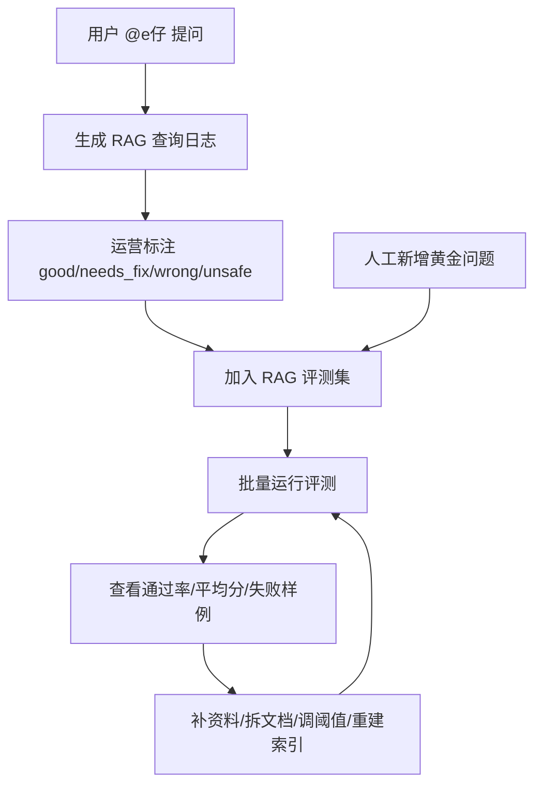

# RAG 质量评测与优化手册

这份文档专门讲校园 e站的 RAG 质量闭环。目标是让 e仔知识库从“能回答”升级为“能评测、能解释、能持续优化”。

## 当前能力

校园 e站已经具备一套轻量 RAG 工程链路：

- 文档管理：`campus_knowledge_document` 保存标题、来源、分类、有效期、状态。
- 切片预览：`campus_knowledge_chunk` 保存切片内容、摘要、关键词和 Qdrant point id。
- 向量检索：`campus-rag` 使用 embedding 写入 Qdrant。
- 混合召回：向量检索 + BM25 关键词检索。
- 融合排序：使用 RRF 融合 dense/sparse 候选。
- 置信度过滤：低于阈值的片段不会交给 e仔。
- 真实日志：`campus_rag_query_log` 保存真实问题、命中片段、回答、耗时和质量标注。
- 回归评测：`campus_rag_eval_case` 保存固定评测问题和最近运行结果。

## 评测闭环

这个闭环解决的是 RAG 项目最常见的问题：改了知识库或检索参数以后，不知道整体质量是变好了还是变差了。

## 评测用例设计

每个评测用例包含：

| 字段 | 说明 |
| --- | --- |
| `question` | 固定测试问题 |
| `expected_document_id` | 期望命中的文档 ID，最严格 |
| `expected_source` | 期望来源，例如学校官网、教务通知 |
| `expected_keywords` | 期望片段包含的关键事实词 |
| `category` | 问题分类 |
| `source_log_id` | 如果来自真实日志，记录日志 ID |
| `last_score` | 最近一次评测分 |
| `last_hit` | 最近一次是否通过 |
| `last_result` | 最近一次命中片段和错误信息 |

推荐至少准备这些用例：

- 高频问题：宿舍、校园网、快递、校车、报到材料、缴费、校园卡。
- 容易混淆的问题：深汕校区和主校区地点不同的问题。
- 时效问题：报到时间、考试安排、活动报名截止时间。
- 无资料问题：知识库没有答案时，应该低置信度或无命中。
- 历史错误问题：真实日志里标注为 `wrong` 或 `needs_fix` 的问题。

## 评分规则

当前评分是轻量规则，不依赖大模型：

- 命中特定文档：主要加分。
- 命中指定来源：辅助加分。
- 命中期望关键词：辅助加分。
- 没有设置期望时，用最高置信度作为观察分。

`last_score >= 0.6` 视为通过。这个阈值不是绝对真理，后续可以根据真实数据调整。

## 召回解释

后台“知识库测试”和“RAG评测”会展示命中片段解释：

| 字段 | 说明 |
| --- | --- |
| `dense_score` | 向量语义相似度 |
| `sparse_score` | BM25 关键词匹配分 |
| `lexical_overlap` | 查询词和片段词面重合 |
| `rrf_score` | dense/sparse 融合排序分 |

排查思路：

- `dense_score` 高、关键词低：语义接近，但可能事实不够精确。
- `sparse_score` 高、语义低：关键词撞上了，但上下文可能不相关。
- `lexical_overlap` 低：问题和资料用词差异大，可以补同义说法或 FAQ。
- 都低：大概率缺资料、文档未启用、资料过期或切片质量差。

## 运营使用流程

1. 每天看“回复状态”，优先处理 `wrong / unsafe / needs_fix`。
2. 把有价值的问题加入“RAG评测”。
3. 每次新增资料、修改资料或重建索引后，运行评测。
4. 通过率下降时，不急着改模型，先看失败样例。
5. 优先补资料结构：
   - 一份资料只讲一个主题。
   - 标题写清楚对象和场景。
   - 把时间、地点、材料、入口、流程拆成清晰段落。
   - 时效性资料必须填有效期。

## 后续可升级方向

首发阶段不建议引入太重的 AI 平台。后续如果真实问题量上来，可以逐步做：

- 加 reranker：在混合召回后对候选片段二次精排。
- 多校区过滤：在文档和查询里加入 `school_code / campus_code` metadata。
- 评测趋势：保存每次评测 run，观察版本变化。
- 无答案评测：明确哪些问题应该拒答或触发无资料默认回复。
- 自动生成 FAQ 候选：从高频真实问题里聚类，提示运营补知识库。

## 简历表达

可以这样讲：

> 我没有只做一个简单向量库，而是设计了 RAG 质量闭环：真实查询日志沉淀问题，后台人工标注质量，错误样例进入评测集，批量运行评测得到命中率和失败样例；检索侧使用 Qdrant 向量召回、BM25 关键词召回和 RRF 融合排序，并在后台展示 dense/sparse/词面重合等解释字段，用于持续优化知识库切片、阈值和资料结构。
