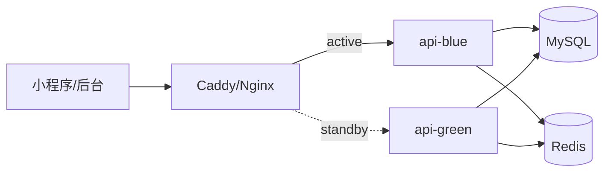

# 发布与无感更新策略

这份文档说明校园 e站在“只有一台服务器、没有独立测试环境”的情况下，如何尽量安全地发布新版本，并逐步演进到用户无感知切换。

结论先说：首发不建议上 K8s。当前更适合用 `Docker Compose + 版本化镜像 + 发布前检查 + 轻量蓝绿切流`。K8s 的滚动更新能力很强，但单节点 K8s 不解决节点故障，也不自动解决数据库迁移风险。

## 发布目标

| 目标 | 做法 |
| --- | --- |
| 没有测试环境也能上线 | 本地完整测试 + 服务器 release-check |
| 发布失败能快速回退 | Git tag / 镜像 tag / 反代切回旧版本 |
| 用户尽量无感 | 应用层蓝绿双版本预热，Caddy/Nginx 秒级切流 |
| 数据库不拖垮回滚 | 只做向前兼容迁移，避免破坏性 SQL |
| 不显著增加成本 | 只复制 API/admin/agent 等应用层，不复制 MySQL/Redis/Qdrant |

## 当前推荐流程

当前仓库已经有 GitHub Actions：`.github/workflows/ci-cd.yml`。

触发规则：

| 事件 | 行为 |
| --- | --- |
| PR 到 `campus-estation-cleanup` | 只跑 CI，不部署 |
| push 到 `campus-estation-cleanup` | 先跑 CI，通过后 SSH 到服务器部署 |
| 手动 `workflow_dispatch` | 跑 CI，通过后部署当前选择的分支 |

也就是说，当前分支 `campus-estation-cleanup` 就是生产发布分支。以后代码合并到这个分支，会自动走到生产部署。

发布前在本地或服务器运行：

```bash
bash scripts/release-check.sh
```

默认会执行：

- `docker compose config`
- 生产 compose config
- `go test ./...`
- `npm --prefix web/admin run build`

如果服务器当前已经跑着生产服务，可以额外检查健康接口：

```bash
RUN_HEALTH_CHECK=1 bash scripts/release-check.sh
```

如果要跑真实 smoke，会注册测试用户并发一条测试帖：

```bash
RUN_HEALTH_CHECK=1 RUN_SMOKE=1 bash scripts/release-check.sh
```

生产环境变量文件不是 `.env.production` 时：

```bash
ENV_FILE=/path/to/.env.production bash scripts/release-check.sh
```

## 普通发布

适合小版本、低峰期、可接受几秒连接抖动的情况。GitHub Actions 自动部署本质上执行的也是这套流程。

```bash
git pull
bash scripts/release-check.sh
docker compose --env-file .env.production -f docker-compose.yml -f docker-compose.prod.yml up -d --build
RUN_HEALTH_CHECK=1 bash scripts/release-check.sh
```

发布后立刻看：

- `docker compose ps`
- API `/healthz` 和 `/readyz`
- 小程序登录、首页、发帖 smoke
- 运营后台登录
- Grafana 健康面板
- 飞书是否有异常告警

## GitHub Actions 部署配置

仓库需要配置这些 GitHub Secrets：

| Secret | 含义 |
| --- | --- |
| `DEPLOY_HOST` | 服务器公网 IP 或域名 |
| `DEPLOY_PORT` | SSH 端口，没填时按 `22` |
| `DEPLOY_USER` | SSH 用户 |
| `DEPLOY_SSH_KEY` | 部署私钥内容 |
| `DEPLOY_PATH` | 服务器上的项目目录，例如 `/opt/lehu-campus` |

服务器需要提前准备：

1. 项目已经 clone 到 `DEPLOY_PATH`。
2. `DEPLOY_PATH/.env.production` 已经配置好，不能提交到 Git。
3. 服务器 SSH 用户能执行 `git pull`、`docker compose`。
4. 服务器上已经安装 Docker 和 Docker Compose v2。
5. `origin` remote 能拉到 `campus-estation-cleanup` 分支。

Actions 部署时会在服务器执行：

```bash
bash scripts/deploy-production.sh
```

这个脚本会：

1. `git fetch origin campus-estation-cleanup`
2. `git reset --hard origin/campus-estation-cleanup`
3. 在服务器跑 compose 配置检查
4. `docker compose --env-file .env.production -f docker-compose.yml -f docker-compose.prod.yml up -d --build`
5. 再跑一次健康检查

Go 测试和后台构建已经在 GitHub Actions 的 CI 阶段跑过；服务器部署阶段不要求安装 Go 和 Node，只要求 Docker、Docker Compose 和 Git 可用。

注意：脚本会 `git reset --hard`，所以服务器项目目录不要手改 tracked 文件；生产密钥只放 `.env.production`。

## 轻量蓝绿发布

如果目标是用户基本无感，就需要同一时间保留两个应用版本。

不要复制整套基础设施。MySQL、Redis、Qdrant、Loki、Prometheus 继续只有一套；只复制流量入口相关的应用容器。

推荐先复制：

- `api`
- `admin-web`
- `campus-agent`

暂不复制：

- `mysql`
- `redis`
- `qdrant`
- `loki`
- `prometheus`
- `grafana`
- `minio`

拓扑：



发布步骤：

1. 当前线上流量走 `blue`。
2. 启动新版本 `green`，绑定到本机备用端口，例如 `127.0.0.1:28080`。
3. 对 `green` 跑健康检查和 smoke。
4. 修改 Caddy/Nginx upstream，把 API 和后台切到 `green`。
5. reload 反代，旧连接自然结束，新请求进入 `green`。
6. 保留 `blue` 10 到 30 分钟。
7. 确认无异常后停掉 `blue`。

回滚：

1. 把反代 upstream 切回 `blue`。
2. reload Caddy/Nginx。
3. 排查 `green` 日志。

## 为什么不直接 K8s

单台 2核4G 服务器上，K8s 的收益有限：

- 单节点没有真正高可用，服务器挂了 K8s 也挂。
- K8s 会增加控制面、Ingress、PVC、Secret、Helm/Kustomize 的维护成本。
- MySQL、Redis、Qdrant、Loki 这类有状态服务在 K8s 里更复杂。
- 数据库迁移失败时，K8s 不能自动救回来。

等以后有两台以上服务器、服务继续拆分、需要多副本或自动扩缩容时，可以考虑迁到 `k3s`。那时迁移理由会更自然：不是为了堆技术，而是为了真实运维需求。

## 数据库迁移规则

无感发布的真正难点是数据库。

所有迁移遵守“expand-contract”：

1. 先 expand：只新增表、字段、索引，字段允许为空或有默认值。
2. 新代码兼容旧数据。
3. 旧代码也能在新 schema 上继续跑。
4. 确认新版本稳定后，后续版本再 contract：删除旧字段或旧逻辑。

首发阶段默认不做自动破坏性迁移：

- 不直接 drop 表。
- 不直接 drop 字段。
- 不直接改字段含义。
- 不把旧枚举值改成不兼容的新枚举。

这样应用版本可以回滚，数据库不会把回滚堵死。

## 服务发布顺序

常规顺序：

1. 数据库向前兼容迁移。
2. `base`、`campus-user` 这类内部依赖服务。
3. `campus-rag`、`campus-agent`。
4. `api`。
5. `admin-web`。

如果本次只改 `api/admin-web/campus-agent`，可以做轻量蓝绿。

如果本次改了 gRPC proto、`base` 或 `campus-user` 的不兼容接口，不建议强行蓝绿。应先做兼容版本，确认 API 新老版本都能调用，再切流。

## 版本标记

每次发布前打 tag：

```bash
git tag release-YYYYMMDD-HHMM
git push origin release-YYYYMMDD-HHMM
```

后续建议把镜像也加 tag：

```text
lehu-campus-api:YYYYMMDD-HHMM-gitsha
lehu-campus-admin-web:YYYYMMDD-HHMM-gitsha
lehu-campus-agent:YYYYMMDD-HHMM-gitsha
```

只使用 `latest` 会让回滚困难，因为你很难确认上一版镜像到底是哪一版。

## 发布检查清单

发布前：

- 当前分支干净，或明确知道未提交改动。
- `bash scripts/release-check.sh` 通过。
- SQL 迁移只做向前兼容。
- `.env.production` 没有占位符。
- 飞书告警可用。

切流后：

- `/healthz` 正常。
- `/readyz` 正常。
- 小程序首页和发帖正常。
- 运营后台登录正常。
- Grafana 健康面板没有新增 down。
- Loki 能查到新版本容器日志。

保留旧版本：

- 蓝绿发布后旧版本至少保留 10 到 30 分钟。
- 确认无异常后再停旧版本。

## 后续可实现的脚本

下一阶段可以继续做：

- `scripts/release-bluegreen.sh`：启动 standby、跑 smoke、切 Caddy upstream。
- `deploy/reverse-proxy/Caddyfile.bluegreen`：维护 blue/green upstream。
- `docker-compose.bluegreen.yml`：只定义 `api-green/admin-green/agent-green`。
- 镜像 tag 化：不在服务器上现场 build，而是提前构建并拉取固定 tag。

首发先把 `release-check.sh` 用起来，发布动作稳定后再上轻量蓝绿。
